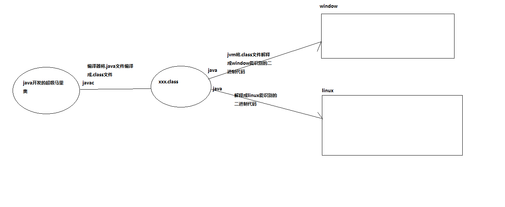

# 第一章：认识java

- **java是一门编程语言**

- **计算机的组成**：

  - 硬件：CPU、内存、硬盘。。。
  - 软件：操作系统、应用软件

- **计算机语言的分类**：

     机器语言：0110101   汇编   ADD    高级语言：你好

  - 低级语言：计算机认识的语言

    - 机器语言：用二进制代码编写的计算机能直接识别和执行的机器指令集合，不同型号的计算机识别的机器指令不同，所以机器语言移植性差、阅读差，机器语言有以下特点：计算机能直接执行、执行速度快、灵活。计算机只能识别二进制
      - 如：011001001101..
    - 汇编语言：使用助记词代替机器语言进行指令操作，助记词就是用英文单词或其缩写替代二进制代码的指定功能和指令操作数的集合，由于汇编语言接近机器语言，所以其可以直接操作硬件，计算机只能识别机器语言，并不认识汇编代码，所有要让汇编代码在计算机上运行，就需要汇编程序将其转为机器语言，这个过程成汇编过程
      - 如：SUB表示减法，ADD表示加法，MOV表示移动

  - 高级语言：对编程语言的封装，但是计算机并不能直接识别高级语言，所有需要将高级语言转为机器语言

    C/C++,python,PHP,JAVA,JAVASCRIPT.....

- **高级语言的分类**

  - 编译型语言C/C++：通过源代码编译成计算机能够识别的机器语言从而能被计算机识别

    - 特点：源代码直接编译成一个可执行的二进制文件(xxx.exe,xxx.bat,xxx.sh),双击运行即可，但是不同的平台需要不同的源代码进行编译后才能被计算机识别

    - 优点：安全，执行速度快

    - 缺点：不跨平台，开发成本高

      

  - 解释型语言：python、PHP:将源代码放到计算机中执行，执行过程中将源码解释成各个平台能够识别的机器语言

    - 这些语言内部运行环境中有一个解释器(翻译官)，不同的平台就将代码翻译成不同平台能够识别的机器语言
  
    - 优点：跨平台

    - 缺点：执行速度较慢，较不安全

      
  
  - 半编译半解释（java属于解释型语言）：当java程序运行时，首先将java源码编译成一个.class文件(二进制文件)，jvm(Java vurtal Machine )再将.class文件解释成各个平台能够识别的机器语言
  
    

- **JDK的安装**

  - 为什么安装JDK

    - 所有编程语言的开发都离不开SDK(software development Kit) 软件开发工具包，java中的开发工具包就是JDK

  - JDK是什么

    - Java Development Kit  java开发工具包

  - 监测jdk环境

    - 进入dos窗口 输入java -version查看java版本

      

      

      - 检查java运行环境：进入dos窗口 输入java

        

      - 检查编译环境  进入dos窗口 输入javac

        

        - 注意：如果以上只要有一个命令输入后出现 不是可执行bat文件...说明jdk没有安装成功

  - 卸载jdk

    - 删除jdk安装目录，如果忘记安装目录的同学可以在环境变量中找到

    - 清除jdk环境变量  
      - 删除JAVA_HOME环境变量
      - 在path环境变量中删除JAVA_HOME/bin;

  - 安装jdk

    - 双击安装程序即可

    - 注意：安装目录不要有中文和空格，jdk1.6之后安装了jdk，jdk中就包含了jre所有不需要单独安装jre

      

      - 配置环境变量：

        - 配置JAVA_HOME:配置jdk安装的根目录

          

          - 配置path环境变量：可以在操作系统的任何地方执行bin目录下的二进制文件

            

          - 计算机中可安装多个JDK但是配置环境变量的时候配哪一个使用的就是哪一个

  - **JDK目录结构**

    

- **JRE：java运行环境**

- **jdk和jre以及jvm的关系**

  

- **第一个java程序**


- **安装集成开发工具eclipse**

  - 直接解压即可：

    

  - 点击eclipse.exe文件运行：JDK版本一定要在1.8及以上

    

- **java项目的目录结构**

  

  - **src目录：类路径**

- 在eclipse中创建的包真实映射到工作空间中的文件系统中

- 注意：放在sre目下的java源文件，会自动编译

  - eclipse中执行java程序

    

- **JVM**：java虚拟机，一台虚拟的计算机
- **jvm什么时候跑起来？**
  - main方法：java程序的入口，当main方法执行JVM就启动了
  - jvm的生命周期：main方法执行时JVM开启运行，main方法运行完JVM停止工作
  - 当有10个main方法同时执行时，有多少个JVM在工作? 10个--采用多线程技术

- **java语言版本：**
  - javaSE:java核心技术
  - javaEE:java开发企业版，为企业级应用程序开发提供解决方案，一共规定了15项大的技术规范，（框架：spring  springMVC MyBatis..）
  - javaME:java迷你版

- **eclipse的简单使用和java中的注释**

  ```java
  /**
   * 文档注释
   * 相当于说明书
   * @author Administrator
   * 注释：注释的代码不会执行
   *  //：单行注释  快捷键：ctrl+/
   * 	代码提示快捷键：alt+/
   */
   /*多行注释：一次注释多行   快捷键ctrl+shift+/ */
  
  public class Student {
  	/**
  	 * main方法是java程序的入口
  	 * @param args 参数
  	 */
  	public static void main(String[] args) {
  //		System.out.println("Student");
  		/*System.out.println("Student1");
  		System.out.println("Student2");
  		System.out.println("Student3");*/
  //		在控制台打印输出
  		System.out.println("Student4");
  		System.out.println("Student5");
  		System.out.println();
  	}
  	
  ```

  