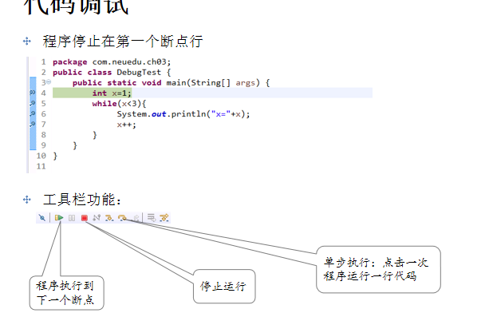

# 第三章：流程控制语句

- ## If语句

```java

		 * 语法：
		 * 	if(A){
		 * 		语句块B;
		 * 	}
		 * 如果A为true执行B,否者不执行
		 * 注意：A的返回值必须是布尔值
		 */
		/*if(1<2) {
			System.out.println("1<2");
		}*/
		if(2<1)
			System.out.println("2<1");
		System.out.println("哈哈");
		
		System.out.println("---------------------------------------------");
//		二选一
		/**
		 * 语法：
		 * if(A){
		 * 	 语句块B
		 * }else{
		 * 	语句块C
		 * 
		 * }
		 * 如果A为true执行B,否者执行C
		 * 
		 */
	/*	if(4<3) {
			System.out.println("4<3 true");
		}else {
			System.out.println("4<3 false");
		}*/
		int money=20000;
		boolean home =true;
		if(money>200000 || home) {
			System.out.println("我们结婚吧");
		}else {
			System.out.println("你是个好人");
		}
		System.out.println("--------------------------------------------------");
		
//		多分支条件
		/**
		 * 语法：
		 * 	if(A){
		 * 	   语句块B;
		 * 	}else if(A1){
		 * 	   语句块C;
		 * }else if(A2){
		 * 	 语句块D;
		 * }...
		 *  else{
		 *     语句块F;
		 * 
		 *  }
		 *  如果A为true执行B,整个分支条件判断语句结束,否者继续判断A1,如果A1为true执行C，整个分支条件判断语句结束，否者继续判断A2以此类推，
		 *  如果分支条件都为false,那么执行else中的语句块F
		 */
		int week=7;
		if(week==1) {
			System.out.println("星期一写代码");
		}else if(week==2) {
			System.out.println("星期二写代码");
		}else if(week==3) {
			System.out.println("星期三熬夜写代码");
		}
		else if(week==4) {
			System.out.println("星期四通宵写代码");
		}else if(week==5) {
			System.out.println("星期五辞职不写代码");
		}else {
			System.out.println("有一个好周末");
		}
		
	}

}
```

- ## 变量作用域

  - 变量只能在初始化之后使用。
  -  在作用域里定义的变量，只能在该作用域中使用。
  - 使用一对大括号包含的语句范围，称为作用域。
  - 在作用域中，变量名不能重复定义。

```java
public static void main(String[] args) {
//		变量的作用域(变量的生命周期)   局部变量 :在某一作用域范围内起作用
//		变量只能在初始化之后使用。
//		在作用域里定义的变量，只能在该作用域中使用。
//		使用一对大括号包含的语句范围，称为作用域。
//		在作用域中，变量名不能重复定义。
		
		int a=10;
		System.out.println("a:"+a);
		if(a==2) {
			System.out.println("a:"+a);
		}
		if(true) {
			a=20;
			System.out.println("a:"+a);
//			int a=20; 在作用域中，变量名不能重复定义。
			int b=20;
//			int b=30;
		}else {
			int b=40;
		}
//		System.out.println("b:"+b); //在作用域里定义的变量，只能在该作用域中使用。
		int b=20;
		System.out.println("b:"+b); 
	}
	
	public void getAge() {
//		System.out.println(b);
	}
```

- ### switch语句

```java
	public static void main(String[] args) {
		/**
		 * switch:相当于if()else if()..else{}
		 * 
		 * switch (表达式){
			case 取值1：
			    语句块1 
			   [break]                      
			    …
			case 取值n：
			    语句块n   
			    [break]                     
			default:          
			    语句块n+1                    
     		}
		 * 注意：
		 * 	①表达式的值只可以接受四个基本数据类型和对应包装类（int、byte、char、short） 、String型(JDK1.7之后)、枚举型
		 *  ②switch case中的值必须要与switch表达式的值具有相同的数据类型。而且case后跟的值必须是常量，不能跟变量
		 *  ③不允许有重复的case取值
		 *  ④switch一旦碰到第一次case匹配，程序就会跳转到这个标签位置，开始顺序执行以后所有的程序代码，
		 *  	而不管后面的case条件是否匹配，直到碰到break关键字或者结束switch语句的大括号为止
		 *  ⑤如果没有case与表达式匹配执行default
		 *  ⑥switch什么时候结束？
		 *  	遇到了第一个break关键字或者结束switch语句的大括号。
		 *  ⑦case之间与default没有顺序。先判断所有的case，没有匹配的case执行default。因此一般将default放在case后面。

		 *  
		 */
//		需求：20~30 奖金为1000  30~40 奖金为2000 40~50 奖金为3000  50~70奖金为4000
		int age=62;
		int level=age/10;
//		switch(level) {
//		default:
//			 System.out.println("奖金为0");
//		 case 2 :
//			 System.out.println("奖金为1000");
//			 break;
//		 case 3 :
//			 System.out.println("奖金为2000");
//			 break;
//		 case 4 :
//			 System.out.println("奖金为3000");
//			 break;
//		 case 5 :
//			 System.out.println("奖金为4000");
//			 break;
//		 case 6 :
//			 System.out.println("奖金为4000");
//			 break;
//		 
//		}
		
		switch(level) {
		
		 case 2 :
			 System.out.println("奖金为1000");
			 break;
		 case 3 :
			 System.out.println("奖金为2000");
			 break;
		 case 4 :
			 System.out.println("奖金为3000");
			 break;
		 case 5 :
		 case 6 :
			 System.out.println("奖金为4000");
			 break;
		 default:
			 System.out.println("奖金为0");
		}
	}

```

- ### 接收控制台输入

```java
/**
 * String类：
 *  字符串： 由字符序列组成  ,属于引用数据类型
 * @author Administrator
 *
 */
public class TestString {

	public static void main(String[] args) {
		/*String s1="zhangsan";
		System.out.println("s1:"+s1);
//		数值与字符串计算时得到的结果为字符串  ：字符串的拼接
		System.out.println(s1+8);//zhangsan8
		System.out.println("zhangsan"+8+9);//zhangsan89
		System.out.println(8+9+"zhangsan");//17zhangsan
		System.out.println("--------------------------------");*/

		Scanner sc=new Scanner(System.in);
//		接收控制台输入		
//		int messageInt=sc.nextInt();//该方法会阻塞(等待),等待控制台的输入的Int数据，当控制台输入完成并回车阻塞解除
//		double messageDouble=sc.nextDouble();
//		String messageString=sc.next();//该方法会阻塞(等待),等待控制台的输入的字符串以空格为结束标志，当控制台输入完成并回车阻塞解除
		String messageString=sc.nextLine();//该方法会阻塞(等待),等待控制台的输入的一行字符串以回车为结束标志，当控制台输入完成并回车阻塞解除
//		输出到控制台
//		System.out.println("messageInt:"+messageInt);
//		System.out.println("messageDouble:"+messageDouble);
		System.out.println("messageString:"+messageString);


	}

}
```

- ### 产生随机数

```java
public class TestRandom {

	public static void main(String[] args) {
//		随机数
		Random r=new Random();
//		随机生成 -2^31~2^31-1的整型数值
		int messIntOne=r.nextInt();
		System.out.println("messIntOne:"+messIntOne);
//		随机生成0~10之间的数  包括0不包括10
		int messIntTwo=r.nextInt(10);
		System.out.println("messIntTwo:"+messIntTwo);
//		随机产生0~1之间的浮点型
		double messDouble=r.nextDouble();
		System.out.println("messDouble:"+messDouble);
//		随机生成0~10之间的数  包括0不包括10
		double dd=123.84234324;
		System.out.println((int)dd);//123
		System.out.println((int)(messDouble*10));
//		随机产生7~21的整型 包括7不包括21   21-7=14
		int messIntThree=r.nextInt(14)+7; //0~14  +7   7~21
		System.out.println("messIntThree:"+messIntThree);
		
	}

}
```

- ## 循环语句

  - **作用**：

    - 重复执行代码片段

    - 遍历容器(后续讲解)

      

  - **for循环**

    ```java
    public class FlowFor {
    	public static void main(String[] args) {
    //		for循环
    		/**
    		 * 
    		 * for(初始化表达式;循环条件表达式；循环后的操作表达式){
    			         执行语句块
    			}
    			for(表达式A;条件表达式B；操作表达式C){
    				  语句块D
    			}
    			①表达式A先执行而且只会执行一次,再执行表达式B,如果B为fasle，循环结束
    			②表达式A先执行而且只会执行一次,再执行表达式B,如果B为true那么执行D,再执行C,再执行B,
    							如果B为true执行D,再执行C以此类推直到B返回fasle循环结束
    		 */
    //		循环输出100次我爱你
    //		for(int i=0;i<100;i++) {
    //			System.out.println("我爱你中国"+i);
    //			
    //		}
    		
    //		for(int i=0;i<100;) {
    //			System.out.println("我爱你中国"+i);
    //			i++;
    //		}
    		
    //		int i;
    //		for(i=0;i<100;i++) {
    //		System.out.println("我爱你中国"+i);
    //	   }
    		
    //		for(int i=0;i<100;) {
    //			i++;
    //			System.out.println("我爱你中国"+i);
    //			
    //		}
    		
    //		死循环： 死循环产生的条件是没有循环终止语句执行
    //		for(;;) {
    //			System.out.println("我爱你中国");
    //		}
    		
    //		for(int i=0;;) {
    //		System.out.println("我爱你中国"+i);
    //	    }
    		
    //		for(int i=0;;i++) {
    //		System.out.println("我爱你中国"+i);
    //	   }
    		
    //		for(int i=0;i<1;i--) {
    //		System.out.println("我爱你中国"+i);
    //	   }
    		
    //		int C=20;
    //		for(int B=0;B<C;B=C+B) {
    //			C++;
    //		}
    
    	}
    
    ```

  - **while和do while循环**

    ```java
    public class FlowWhile {
    	public static void main(String[] args) {
    //		while循环
    		/**
    		 * 语法：
    		 * 	while(表达式A){	
    		 * 		语句块B;
    		 * 		循环终止操作;
    		 * 	}
    		 *  注意：表达式A返回值为boolean
    		 *  如果表达式A为true执行B,直到A返回false终止循环
    		 * 
    		 */
    //		循环一百次我爱你中国
    		int i=0;
    /*		while(i<100) {
    			System.out.println("我爱你中国");
    			i++;
    		}*/
    		
    //		debug代码调试
    //		int j=20;
    //		int x=30;
    //		int m=80;
    //		System.out.println(j+x+m+i);
    		
    //		死循环
    //		while(i==0) {
    //			System.out.println("我爱你中国");
    //		}
    //		while(true) {
    //			System.out.println("我爱你中国");
    //		}
    		
    //		do while循环
    		/**
    		 * do{
    		 *      语句块B
    		 *   循环终止操作;   
    		 * }while(表达式A)
    		 * 
    		 * 注意：语句块B无论如何都会执行一次
    		 * 先执行语句块B,再执行A,如果A为true继续执行B,直到A返回false
    		 */
    		
    //		do{
    //			System.out.println("我爱你中国"+i);
    //			i++;
    //		}while(i<100);
    		
    //		死循环
    		do{
    		System.out.println("我爱你中国"+i);
    		i++;
    	   }while(true);
    ```

    

- **代码调试**：
  - 可以让代码一行一行的执行，观察每行代码变量值的改变
    - 设置断点
    - 启动调试运行
    - 单步执行
    - 观察变量



- ### 循环嵌套

```java

	public static void main(String[] args) {
//		循环嵌套 ：循环中再嵌套循环
//		输出5次 10个我爱你中国
//	 for(int j=0;j<5;j++) {	
//		for(int i=0;i<10;i++) {
//			System.out.println("我爱你中国"+i);
//		}
//		System.out.println("--------------------");
//	 }
		
//		int j=0;
//		while(j<5) {
//			for(int i=0;i<10;i++) {
//			System.out.println("我爱你中国"+i);
//		    }
//			j++;
//			System.out.println("-----------------------------");
//		}
		
//		九九乘法表
/*		1*1=1
		1*2=2 2*2=4
		1*3=3 2*3=6 3*3=9
		...*/
		
		/*for(int i=1;i<=9;i++) {
			System.out.println(1+"*"+i +"=" +(1*i));
		}*/
//		第一行：
//		for(int i=1;i<=1;i++) {
//			System.out.println(1+"*"+i +"=" +(1*i));
//		}
////		第二行：
//		for(int i=1;i<=2;i++) {
//			System.out.print(i+"*"+2 +"=" +(2*i)+" ");
//			
//		}
//		
		for(int i=1;i<=9;i++) { //行
			for(int j=1;j<=i;j++) { //列
				System.out.print(j+"*"+i+"="+(i*j)+" ");
			}
			System.out.println("\n");//换行
			
		}

	}
```

- ### 循环中断

```java
	public static void main(String[] args) {
//   循环中断
//	 break或continue语句
		/**
		 * break直接跳出循环或者switch语句
		 * 		break 语句用于终止最近的封闭循环或它所在的 switch 语句。控制传递给终止语句后面的语句。
		 * 		可以出现在while、do…while、for、switch语句体中。
		 * continue:跳出当前循环执行下一次循环
		 * 		语句将控制权传递给它所在的封闭迭代语句的下一次迭代
		 * 		只能出现在循环语句while、do…while、for中
		 */
//		只想输出1到4行数据
	/*	for(int i=1;i<=9;i++) { //行
			if(i==5) {
				break; //直接跳出循环
			}
			for(int j=1;j<=i;j++) { //列
				System.out.print(j+"*"+i+"="+(i*j)+" ");
			}
			System.out.println("\n");//换行
			
		}*/
//		第五行数据不输出其他都输出
		for(int i=1;i<=9;i++) { //行
			if(i==5) {
				continue; //跳出当前循环执行下一次循环
			}
			for(int j=1;j<=i;j++) { //列
				System.out.print(j+"*"+i+"="+(i*j)+" ");
			}
			System.out.println("\n");//换行
		}
		System.out.println("-----------------------");
		

//		只想输出1~4列数据
		for(int i=1;i<=9;i++) { //行
			for(int j=1;j<=i;j++) { //列
				if(j==5) {
					break;
				}
				System.out.print(j+"*"+i+"="+(i*j)+" ");
			}
			System.out.println("\n");//换行
		}
//		第五列数据不输出其他都输出
		for(int i=1;i<=9;i++) { //行
			for(int j=1;j<=i;j++) { //列
				if(j==5) {
					continue;
				}
				System.out.print(j+"*"+i+"="+(i*j)+" ");
			}
			System.out.println("\n");//换行
		}
		
//		continue label中断 :给for循环起别名
		outer:for(int i=1;i<=9;i++) { //行
			inner:for(int j=1;j<=i;j++) { //列
				if(i==2) {
					break outer;
				}
				System.out.print(j+"*"+i+"="+(i*j)+" ");
			}
			System.out.println("\n");//换行
		}
		
	}
```

