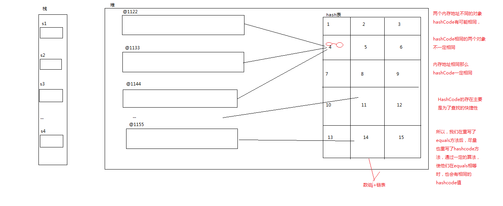
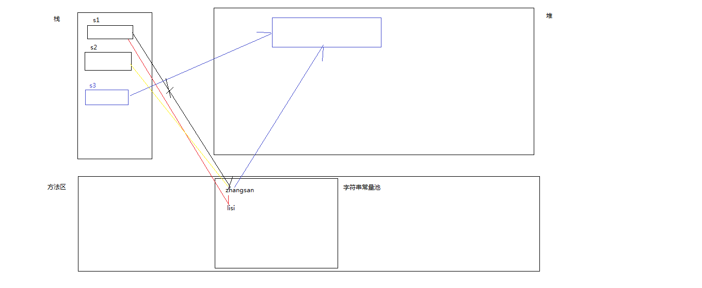
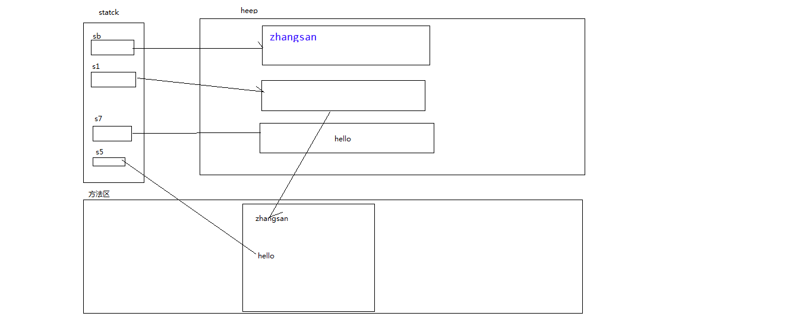

# 第九章：工具类

- ## JAVA API

  ​	API (Application Programming Interface)  应用程序接口

  ​	java API :java应用程序接口,就是JDK提供的各种功能的Java类

  ​	java API 帮助文档：JDK中各种功能类的介绍文档

- ## Object类

  - 概述：object类是所有类的父类 ，Object是Java语言中唯一一个没有父类的类。

  ```java
  /**
   * Object中的方法
   * @author Administrator
   *
   */
  public class TestObject {
  //	equals方法  一般子类会重写Object类中的equals方法实现不同的功能
  	public static void testObjectEquals() {
  //		equals(Object o) 在Object中用来判断两个对象内存地址是否相同
  		Object o1=new Object();
  		Object o2=new Object();
  //		== 用于基本数据类型时判断两个值是否相同
  //		== 用于引用数据类型时判断两个对象的内存地址是否相同
  		System.out.println(o1);
  		System.out.println(o2);
  		System.out.println("o1==o2:"+(o1==o2));//o1==o2:false
  		System.out.println(o1.equals(o2));//false
  		
  		Student s1=new Student();
  		s1.age=10;
  		Student s2=new Student();
  		s2.age=10;
  		System.out.println(s1.equals(s2));
  	}
  //	String 类中的equals方法
  	public static void testStringEquals() {
  		String s1=new String("zhangsan");
  		String s2=new String("zhangsan");
  		System.out.println(s1+","+s2);
  		System.out.println(s1==s2);//false
  		
  //		首先判断两个字符串地址是否相同，如果不相同，判断内容是否相同，如果内容相同返回true否者false;
  //		总结：要判断两个字符串内容是否相同使用equals即可
  		System.out.println(s1.equals(s2));//true
  		
  //		equals和==的区别：
  //		== 用于基本数据类型时判断两个值是否相同，用于引用数据类型时判断两个对象的内存地址是否相同
  //		equals方法在Object中是判断两个对象的内存地址是否相同,子类重写equals方法之后实现的是子类中重写了equals方法的功能
  //		比如 String类中的equals用来判断两个字符串内容是否相同 的。
  		
  	}
  	
  //	HashCode:返回十六进制对象内存地址(对象的hash码)，通过hash算法将对象的地址转为十六进制数之后返回
  	public static void testObjectHashCode() {
  		Object o1=new Object();
  		Object o2=new Object();
  		System.out.println(o1);//@7852e922
  		System.out.println(o2);//@4e25154f
  		System.out.println(o1.hashCode());//2018699554
  		System.out.println(o2.hashCode());//1311053135
  	}
  //	toString：返回对象的内存地址
  	public static void testObjectToString(){
  		Object o1=new Object();
  		System.out.println(o1.toString());//@7852e922
  //		新建的类一般重写toString方法：输出对象的具体内容
  		Student s=new Student();
  		System.out.println(s.toString());//Student [age=0]
  		
  	}
  	
  	public static void main(String[] args) {
  //		testObjectEquals();
  //		testStringEquals();
  //		testObjectHashCode();
  		testObjectToString();
  		
  	}
  
  }
  ```

  

- ## 包装类（封装类）

  

  ```java
  /**
   * 包装类
   * @author Administrator
   *
   */
  public class TestInteger {
  
  	public static void main(String[] args) {
  /*		数据类型	包装类
  		boolean	Boolean
  		byte	Byte
  		char	Character
  		double	Double
  		float	Float
  		int	 Integer
  		long	Long
  		short	Short*/
  		
  //		包装类的作用：用来实现基本数据类型与引用数据(String)类型的转换
  		
  //		int--Integer
  		int i1=129;
  //		方式一：通过构造器
  		Integer ig1=new Integer(i1);
  		System.out.println(ig1);//1
  //		方式二：valueOf
  		ig1=Integer.valueOf(128);
  		Double.valueOf(20.9);
  		System.out.println(ig1);//128
  //		方式三：jdk1.5之后，自动装箱--隐式转换
  		Integer ig2=20;
  		System.out.println(ig2);//20
  		ig2=129;
  		System.out.println(ig2);//129
  		
  		
  //		面试题：
  		Integer ig3=new Integer(129);
  		Integer ig4=new Integer(129);
  		System.out.println(ig3==ig4);//false
  		System.out.println(ig3.equals(ig4));//true
  //		100存放于整型常量池中
  		Integer ig5=100;
  		Integer ig6=100;
  		System.out.println(ig5==ig6);//true
  //		整型常量池范围：-128~127
  		ig5=128;
  		ig6=128;
  //		如果存数不在-128~127 ,就会默认调用valueOf方法，而valueOf会在堆内存新建对象存储数据
  		System.out.println(ig5==ig6);//false
  		System.out.println(Integer.valueOf(123)==Integer.valueOf(123));//true
  		System.out.println(Integer.valueOf(128)==Integer.valueOf(128));//false
  
  //		Integer --int
  		Integer ig7=new Integer(10);
  		int i7=ig7.intValue(); //intValue() 不是静态方法
  		System.out.println(i7);//10
  //		Double-- double
  		Double d1=new Double(20.7);
  		double d=d1.doubleValue();
  		
  //		自动拆箱 
  		i7=ig7;
  		int i8=new Integer(233);
  		
  		
  //		Integer--String 
  		String s7=ig7.toString();
  		System.out.println(s7);
  		
  //		String -- Integer
  //		方式一：构造方法
  		Integer ig8=new Integer("9000");
  		System.out.println(ig8);
  //		方法二：valueOf(String s)
  		Integer.valueOf("124");
  		
  //		int--String 
  		Integer ig10=i7;
  		String ss=ig10.toString();
  		
  //		String--int
  		int i9=Integer.parseInt("7788");
  		System.out.println(i9);
  
  	}
  
  }
  ```

- ## String类

  - 概念：一组字符序列

  - 特点：

    - String是final修饰的类，无法继承

    - String类是不可改变的，对它的每一次赋值都会在内存中创建新的对象

      

    

```java
//		只要是String类型，它们的值都存放在字符串常量池中
		String s1="zhangsan";

//		s1="lisi";
		System.out.println(s1.toString());
//		简单创建字符串的两种方式
		String s2="zhangsan"; //在字符串常量池中创建字符串对象
		System.out.println(s1==s2);//true
		//只创建了一个对象，先看字符串常量池中是否有指定的字符串，如果有就不需要在字符串常量池中创建对象，只在堆区中创建对象
		String s3=new String("zhangsan");
		System.out.println("s2:"+s2);
		System.out.println("s3:"+s3);
		
		System.out.println(s3==s2);//false
		System.out.println(s3.equals(s2));//true
		
		String s4=new String("wangwu");//创建了两个对象
		String s5=new String("wangwu");//只创建了一个对象
		System.out.println(s4==s5);//false
		
		
		
	}
```

- **字符串的创建**

```java

//		字符串的创建： String类构造方法
//		方式一：
		String s1="zhangsan";
		s1=null;
		System.out.println("s1:"+s1);//空值
		s1="";
		System.out.println("s1:"+s1);//空串
		s1=" ";
		System.out.println("s1:"+s1);//空格
//		方式二：
		String s2=new String("zhangsan");
//		s2=new String(null); 编译错误
		s2=new String();
		System.out.println("s2:"+s2);//空串
//		方式三：  char[]-String String( char chars[ ])	使用一个字符数组创建一个String对象。
		char[] c= {'中','国','我','爱','你'};
		System.out.println(Arrays.toString(c));//[中, 国, 我, 爱, 你]
		String s3=new String(c);
		System.out.println("s3："+s3);//中国我爱你
		
//		方式四：String( char chars[ ], int startIndex, int numChars) 
		/**
		 * chars[ ]字符数组	startIndex 开始索引   numChars字符数 :包含开始索引
		 */
		s3=new String(c,2,3);
		System.out.println("s3："+s3);//我爱你
//		String--char[]  toCharArray()方法
		c=s3.toCharArray();
		System.out.println(Arrays.toString(c));//[我, 爱, 你]
		
//		String--byte[]  编码   通过getBytes()方法
		String s4="我爱你中国"; 
//		Unicode(UTF-8)编码下：一个中文三个字节  GBK(gb-2312):一个中文两个字节
		byte[]  b=s4.getBytes();//使用当前项目字符集进行编码 
		System.out.println(Arrays.toString(b));//[-26, -120, -111, -25, -120, -79, -28, -67, -96, -28, -72, -83, -27, -101, -67]
		b=s4.getBytes("gbk");//使用指定字符集进行编码 
		
		System.out.println(Arrays.toString(b));//[-50, -46, -80, -82, -60, -29, -42, -48, -71, -6]
//		方式五：byte[] --String 解码  String( byte asciiChars[ ])	       使用一个字节数组创建一个String对象
		s4=new String(b); //使用当前项目字符集进行解码 
		System.out.println(s4);//�Ұ����й�
//		注意：使用什么字符集进行编码就需要用对应的字符集进行解码
		s4=new String(b,"gbk");//使用指定字符集进行解码
		System.out.println(s4);//我爱你中国
		
//		方式六：String(StringBuffer buffer)         使用StringBufffer对象中的内容为该对象初始化。
		StringBuffer sb=new StringBuffer("我爱你中国"); //String --StringBuffer
		System.out.println(sb);
		
//		StringBuffer--String
		String s5=new String(sb);
		System.out.println(s5);//我爱你中国
```

- **一道面试题**

```java
StringBuffer sb=new StringBuffer("zhangsan");//只创建了一个对象
		String s1=new String("zhangsan");//创建了两个的对象
		System.out.println("s1==sb:"+(s1==sb.toString()));//s1==sb:false
		
		String s2="he";
		String s3="llo";
//		字符串常量相加时在子串常量池中创建对象
		String s4="he"+"llo";
		String s5="hello";
		String s6=new String("hello");
//		字符串常量和字符串引用或者字符串引用与引用之间相加是会StringBuffer对象保存字符串字面量
		String s7=s2+s3;
		String s8=s2+"llo";
		System.out.println("s4："+s4);//hello
		System.out.println("s5："+s5);
		System.out.println("s6："+s6);
		System.out.println("s6："+s6);
		System.out.println("s7："+s7);
		System.out.println("s8："+s8);//hello
		
		System.out.println("s4==s5:"+(s4==s5));//s4==s5:true
		System.out.println("s4==s6:"+(s4==s6));//s4==s5:false
		System.out.println("s5==s7:"+(s5==s7));//s5==s7:false
		System.out.println("s5==s8:"+(s5==s8));//s5==s8:false
		System.out.println("s7==s8:"+(s7==s8));//s7==s8:false
		System.out.println("s5==s8:"+(s5==s8));//s5==s8:false

```

​				

- ## String类中的方法

```java
//		String 类中的方法
//		boolean  equals(String)	判断两个字符串对象的内容是否相等
		
//		boolean  equalsIgnoreCase(String)	比较两个字符串的内容是否相等，忽略大小写
		String s1="ZHangSan";
		if("zhangsan".equalsIgnoreCase(s1)) {
			System.out.println("用户名正确");
		}
//		String toUpperCase( )	将String对象中的所有字符都转换为大写 ,返回新的字符串
		String s2=s1.toUpperCase();
		System.out.println(s1);//ZHangSan
		System.out.println(s2);//ZHANGSAN
//		String toLowerCase( )	将String对象中的所有字符都转换为小写 ,返回新的字符串
		
		String s3="wu.yuehong.com";
//		int length() 返回字符串的长度
		System.out.println(s3.length());//14
		 
//		char  charAt(int)	返回指定索引处的 char值,字符串是由索引的，索引从0开始  索引最大为length-1	
		char c=s3.charAt(0);
		System.out.println("c:"+c);//w
//		c=s3.charAt(14);
//		System.out.println("c:"+c);//String index out of range: 14
		
//		String substring(int begin)	返回一个新字符串，该字符串是从begin开始的字符串的内容,包含开始索引
//		s3=s3.substring(0);
//		System.out.println("s3:"+s3);//wu.yuehong.com
//		s3=s3.substring(1);
//		System.out.println("s3:"+s3);//u.yuehong.com
		
//		String substring(int begin,int end)	返回一个新字符串，该字符串是从begin开始到end-1结束的字符串的内容，不包含结束索引
//		s3=s3.substring(3, 5);
//		System.out.println("s3:"+s3);//yu
//		s3=s3.substring(3,14);
//		System.out.println(s3);//yuehong.com

	
//		int   indexOf/lastIndexOf(char)	返回指定字符在此字符串中第一次/最后一次出现处的索引。 如果没有找到返回-1
//		String s3="wu.yuehong.com";
		System.out.println(s3.indexOf('.'));//2
		System.out.println(s3.indexOf('x'));//-1
		System.out.println(s3.lastIndexOf('.'));//10
		
//		int   indexOf/lastIndexOf(char,int)	从指定的索引开始搜索，返回在此字符串中第一次/最后一次出现指定字符处的索引
//		indexOf从左往右找
		System.out.println(s3.indexOf('.',2));//2
		System.out.println(s3.indexOf('.',3));//10
		System.out.println(s3.indexOf('.',-1));//2  如果第二参数为负数开始索引为0
//		lastIndexOf 简单来说从右往左找字符第一次出现的位置
		System.out.println(s3.lastIndexOf('.',0));//-1
		System.out.println(s3.lastIndexOf('.',-1));//-1
		System.out.println(s3.lastIndexOf('.',3));//2
		System.out.println(s3.lastIndexOf('.',2));//2
		System.out.println(s3.lastIndexOf('.',5));//2
		System.out.println(s3.lastIndexOf('.',13));//10
		System.out.println(s3.lastIndexOf('.',9));//2
		
//		int   indexOf/lastIndexOf(String)	返回第一次出现的指定子字符串在此字符串中的索引
//		String s3="wu.yuehong.com";
		System.out.println(s3.indexOf("wu"));//0
		System.out.println(s3.indexOf(".y"));//2
//		int   indexOf/lastIndexOf(String,int)	从指定的索引开始搜索，返回在此字符串中第一次/最后一次出现指定字符串处的索引
		System.out.println(s3.indexOf(".y",0));//2
		System.out.println(s3.indexOf(".yue",2));//2
		System.out.println(s3.indexOf(".yue",3));//-1

//		String trim( )	返回新的字符串，忽略前导空白和尾部空白  
		System.out.println(s3.trim());//wu.yuehong.com
		String username ="    ";
//		非空判断
		if(username.trim()!=null && !"".equals(username.trim())) {
			System.out.println("用户名不为空");
		}else {
			System.out.println("用户名为空");

		}
//		int   length( )	返回此字符串的长度	
//		String   concat(String str) 	将指定字符串连接到此字符串的结尾 ,返回新的字符串
		String s4="zhangsan";
		s4=s4.concat("lisi");
		System.out.println(s4);//zhangsanlisi
//		byte[]   getBytes()	使用平台的默认字符集将此 String 编码为 byte 序列，并将结果存储到一个新的 byte 数组中
//		byte[]  getBytes(Charset charset) 	使用给定的 charset将此 String 编码到 byte 序列，并将结果存储到新的 byte 数组
		
//		String[] split(String regex) 	根据给定正则表达式的匹配拆分此字符串。字符串劈开
		String dateString="1997-12-20";
		String[] ss= dateString.split("-");
		System.out.println(Arrays.toString(ss));
		System.out.println("年："+ss[0]);//1997
		
		dateString="1997 12 20";
		ss=dateString.split(" ");
		System.out.println(Arrays.toString(ss));//[1997, 12, 20]
		
		dateString="      1997    12   20     ";
		ss=dateString.split(" ");
		System.out.println(Arrays.toString(ss));//[, , , , , , 1997, , , , 12, , , 20]

//		String  replace(char oldChar, char newChar) 	返回一个新的字符串，它是通过用 newChar 替换此字符串中出现的所有 oldChar 得到的
		String s5="zhangsan你太laji";
		System.out.println(s5.replace("laji", "***"));//zhangsan你太***
//		boolean  startsWith(String prefix) 	测试此字符串是否以指定的前缀开始,判断文件名或者反问路径
		String s6="a.jpg";
		System.out.println(s6.startsWith("a"));//true
//		success.html
		s6="success.html";
		if(s6.startsWith("success")) {
			System.out.println("访问success.html");
		}
		
//		boolean   endsWith(String suffix) 	测试此字符串是否以指定的后缀结束
		if(s6.endsWith(".jpg")) {
			System.out.println("是jpg图片");
		}
	}
```

- ## Character中的方法

```java
	char c='中';
		Character cc=c;
		System.out.println(cc);
		Character c1='中';
		System.out.println(c1);
//		String toString(char)  char-String
		System.out.println(Character.toString('在'));
		System.out.println(Integer.MAX_VALUE);//2147483647
		
//		static boolean isDigit(char ch)	判断字符ch是否为数字
		System.out.println(Character.isDigit('A'));//false
		System.out.println(Character.isDigit('8'));//true
		
//		static boolean isLetter(char ch)	判断字符ch是否为字母或中文
		System.out.println(Character.isLetter('中'));//true
		System.out.println(Character.isLetter('Z'));//true
		System.out.println(Character.isLetter('国'));//true
		System.out.println(Character.isLetter('@'));//false

//		static boolean isLowerCase(char ch)	判断字符ch是否为小写字母
		System.out.println(Character.isLowerCase('a'));//true
		System.out.println(Character.isLowerCase('A'));//false

//		static boolean isSpaceChar(char ch)	判断字符ch是否为Unicode中的空格
		System.out.println(Character.isSpaceChar(' '));//true

	}
```

- **StringBuffer类**

  - 概念：一组字符序列

  - 特点：可改变的字符序列，字面量存放在堆区

    ```java
    //		StringBuffer的构造器及方法
    		/**
    		 * 缓冲区:可变的内存空间
    		 * 		扩容的算法：先确定初始容量n，如果append方法添加字符串超过容量之后 容量扩容到2n+2
    		 * 		         ,如果容量还不够存放添加进缓冲区的字符串那么 将当前的容量设为n继续扩容2n+2
    		 */
    		
    //		构造一个其中不带字符的字符串缓冲区，其初始容量为 16 个字符，如果存放的字符超过16个会自动扩容
    		StringBuffer sb1=new StringBuffer();
    //		capacity():返回缓冲区容量
    		System.out.println(sb1.capacity());//16
    //		append方法：将字符拼接到字符串缓区中
    		sb1.append("zhangsan");
    		System.out.println(sb1);//zhangsan
    		sb1.append("wangwu");
    		System.out.println(sb1);//zhangsanwangwu
    		System.out.println(sb1.capacity());//16
    		sb1.append("lis");
    		System.out.println(sb1.capacity());//34
    		sb1.append("qwertyuioplkjhgfds");
    		System.out.println(sb1.capacity());//70
    		
    //		构造一个不带字符，但具有指定初始容量的字符串缓冲区。
    		StringBuffer sb2=new StringBuffer(3);
    		System.out.println(sb2.capacity());
    		sb2.append("zhangsan");
    		System.out.println(sb2);//zhangsan
    		System.out.println(sb2.capacity());//8
    		
    //		构造一个字符串缓冲区，并将其内容初始化为指定的字符串内容。 初始容量： 16+n  n:字符串的长度
    		StringBuffer sb3=new StringBuffer("zhang");
    		System.out.println(sb3);
    		System.out.println(sb3.capacity());//21 
    		sb3.append("lisi");
    		System.out.println(sb3.capacity());//21 
    		
    //		int  capacity( )	返回当前容量 
    //		int  length( )	返回长度（字符数）
    //		StringBuffer  reverse( )	将此字符序列用其反转形式取代  用于判断回文数
    		StringBuffer sb=new StringBuffer("12345");
    		sb.reverse();
    		System.out.println(sb);//54321
    		/**
    		 * 判断某个数是否是回文数
    		 */
    		sb=new StringBuffer("12321");
    		if((sb.toString()).equals((sb.reverse()).toString())) {
    			System.out.println("sb是回文数");
    		}
    		
    		
    //		void  setCharAt(int,char)	将给定索引处的字符设置为 ch 
    		sb=new StringBuffer("wu.yuehong.com");
    		sb.setCharAt(2, '@');
    		System.out.println(sb);//wu@yuehong.com
    		
    //		StringBuffer  delete(int begin,int end)	移除此序列的子字符串中的字符   包含开始索引不包含结束索引
    		sb.delete(2, 10);
    		System.out.println(sb);//wu.com
    //		char  charAt(int)	返回此序列中指定索引处的 char 值 
    //		String  toString( )	将StringBuffer对象转换成相应的String
    //		StringBuffer  append(String  str)	将指定的字符串追加到此字符序列 
    		
    //		StringBuffer  append(int  num)	将 int 参数的字符串表示形式追加到此序列 
    		sb.append(true);
    		System.out.println(sb);//wu.comtrue
    		sb.append(123);
    		System.out.println(sb);//wu.comtrue123
    //		StringBuffer  append(Object o)	追加 Object 参数的字符串表示形式 
    		int[] i= {1,2,3};
    //		System.out.println(i.toString());
    		System.out.println(Arrays.toString(i));//[1, 2, 3]
    		sb.append(i);
    		System.out.println(sb);//wu.comtrue123[I@7852e922
    		sb.append(Arrays.toString(i));
    		System.out.println(sb);//wu.comtrue123[I@7852e922[1, 2, 3]
    		
    //		StringBuffer  insert(int index,String str)	将字符串插入此字符序列中 index:索引位置  str：添加的字符串
    		sb.insert(2, "zhang");
    		System.out.println(sb);
    //		StringBuffer  insert(int index,char ch)	将字符插入此字符序列中 
    //		StringBuffer  insert(int index,Object o)	将 Object 参数的字符串表示形式插入此字符序列中 
    	}
    ```

- **StringBuilder类**

  - 所有的StringBuilder操作和特点都与StringBuffer一致
  - 不同点：
    - StringBuffer线程安全（线程同步）：保证了数据的安全和数据的一致性，但是并发操作速度慢
    - StringBuilder线程不安全（线程不同步）：不保证数据的安全和一致性，但是并发操作速度快

- ## Math类

  ```java
  	public static void main(String[] args) {
  //		Math类中封装了许多对数字进行操作的方法，都是静态方法
  //		Math中的常量
  		System.out.println(Math.PI);//3.141592653589793
  		
  //		static int abs(int)	返回参数的绝对值，返回值类型与参数类型相同
  		double d=Math.abs(-90.0);
  //		static double abs(double)	返回参数的绝对值
  		
  //		static double ceil(double)	返回大于所给参数的最小的整数值  向上求整
  		System.out.println(Math.ceil(123.45));//124.0
  //		static double floor(double)	返回不大于所给参数的最大的整数值  向下求整
  		System.out.println(Math.floor(123.45));//123.0
  //		static int   max(int a,int b)	返回两个int值中较大的一个
  		System.out.println(Math.max(12,1));//12
  //		static double max(double,double)	返回两个double值中较大的一个
  //		static int min(int a,int b)	返回两个int值中较小的一个
  		System.out.println(Math.min(12,1));//1
  //		static double min(double,double)	返回两个double值中较小的一个
  		
  
  //		static double random( )	返回在0.0~1.0之间的随机的double值
  		Random r=new Random();
  		System.out.println(r.nextDouble());
  		double d1=Math.random();
  		System.out.println(d1);
  //		返回12-27之间的整数   (27-12)*ii+12
  		int ii=(int)(d1*15)+12; 
  		System.out.println(ii);
  
  //		static int round(double)	返回同所给值最接近的整数，采用4舍5入法
  		System.out.println(Math.round(123.456));//123
  		System.out.println(Math.round(123.556));//124
  //		static double sin/cos/tan(double)	返回给定的弧度值对应的三角函数值
  		System.out.println(Math.sin(Math.PI/2));//1.0
  		System.out.println(Math.cos(0)); //1.0
  		System.out.println(Math.tan(Math.PI));
  		System.out.println(Math.sin(0));//0.0
  		System.out.println(Math.sin(0));
  		
  //		static double sqrt(double) 	返回所给值的平方根，若所给值为负数则返回NaN
  ```

  

- ## java.util.Date类

  ```java
  /**
   * java.util.Date:java中的日期类，这个类里面的许多方法已经过时
   * java.sql.Date:数据库中的日期类
   * @author Administrator
   *
   */
  public class TestDate {
  
  	public static void main(String[] args) {
  //		构造方法
  		Date d=new Date();
  		System.out.println(d);//Tue Dec 08 10:14:14 CST 2020
  		System.out.println(new Date());
  		
  //		Date Date(long date)  使用给定的毫秒时间价值构建 Date对象。   在指定日期January 1, 1970, 00:00:00的基础上计算日期
  		Date d1=new Date(1000);
  		System.out.println(d1);//Thu Jan 01 08:00:01 CST 1970
  		System.out.println(new Date(1000000000));//Mon Jan 12 21:46:40 CST 1970
  		
  		System.out.println(d.getHours());//10
  //		Date类常用方法--比较日期
  //		getTime() 返回日期的毫秒值
  		System.out.println(d.getTime());//1607393961053
  		
  //		boolean after(Date when)	测试当前日期是否在指定日期之后 
  		Date d2=new Date(90000);
  		System.out.println(d2);
  		if(d.after(d2)) {
  			System.out.println("d 大于 d2");
  		}else {
  			System.out.println("d 小于于 d2");
  		}
  		
  //		boolean before(Date when)	测试当前日期是否在指定日期之前
  		if(d.before(d2)) {
  			System.out.println("d 小于 d2");
  		}else {
  			System.out.println("d 大于 d2");
  		}
  		/**
  		 * 比较两个日期的顺序。如果参数 Date 等于此 Date，则返回值 0；
  		 * 如果此 Date 在 Date 参数之前，
  		 * 则返回小于 0 的值；如果此 Date 在 Date 参数之后，则返回大于 0 的值。
  		 */
  //		int compareTo(Date anotherDate) 
  		int flog=d.compareTo(d2);
  		if(flog==0) {
  			System.out.println("两个日期相等");
  		}else if(flog<0) {
  			System.out.println("d<d2");
  		}else {
  			System.out.println("d>d2");
  		}
  	}
  
  ```

  

- ## Calender类

  ```java
  
  /**
   *  常用的日期处理的对象。可以设置自己的时区和国际化格式。
  	是一个抽象类。
  	Calendar 抽象类定义了足够的方法，让我们能够表述日历的规则 
   * @author Administrator
   *
   */
  public class TestCalendar {
  
  	public static void main(String[] args) {
  //		获取Calendar实例
  		Calendar cld=Calendar.getInstance();
  		System.out.println(cld);
  		System.out.println(cld.YEAR);//1
  //		获取时间
  		System.out.println(cld.get(Calendar.YEAR));//2020 年
  		System.out.println(cld.get(Calendar.MONTH));//11月   通过Calendar获取的月份比当前月份少一个月,12月份为0
  		System.out.println(cld.get(Calendar.MONTH)+1);//12
  		System.out.println(cld.get(Calendar.DATE));//8号
  		System.out.println(cld.get(Calendar.HOUR));//10点
  		System.out.println(cld.get(Calendar.DAY_OF_WEEK));//3 
  //		设置时间
  		cld.set(1995, 9, 12, 9, 56);
  		System.out.println(cld.get(Calendar.HOUR));//9
  		System.out.println(cld.get(Calendar.MONTH));//9
  		
  //		System.out.println(Calendar.YEAR);//1
  		
  //		返回Date
  		Date dd=cld.getTime();
  		System.out.println(dd);//Thu Oct 12 09:56:27 CST 1995
  
  	}
  
  }
  ```

  

- ## SimpleDateFormat类

```java
/**
 * String与Date之间互相转换，使用simpleDateFormat类
 * 
 * @author Administrator
 *
 */
public class TestOne {
	public static Date stringToDate(String dateString) {
		/**
		 * 语法
		 * SimpleDateFormat sf=new SimpleDateFormat(格式化日期格式)
		 *  注意：
		 *  	parse(String dd)方法将字符串转日期
		 *  	dd中的日期格式必须和格式化日期格式一致
		 *  	
		 */
		SimpleDateFormat sf=new SimpleDateFormat("yyyy-MM-dd hh");
		try {
			Date d=sf.parse(dateString);
			return d;
		} catch (ParseException e) {
			e.printStackTrace();
		}
		return null;
		
	}
	
	public static String dateToString(Date d) {
//		SimpleDateFormat sf=new SimpleDateFormat("yyyy-MM-dd HH:mm:ss S E a");
//		SimpleDateFormat sf=new SimpleDateFormat("yyyy/MM/dd HH:mm:ss S E a");
//		SimpleDateFormat sf=new SimpleDateFormat("yyyy\\MM\\dd HH:mm:ss S E a");
		SimpleDateFormat sf=new SimpleDateFormat("yyyy年MM月dd日 HH时:mm分:ss秒");
		String s=sf.format(d);
		return s;
		
	}
	public static void main(String[] args) {
		String dateString="1995-12-10 12";
		System.out.println(dateString);
//		调用String转Date的方法
		Date d=stringToDate(dateString);
		System.out.println(d);
		
		Date dd=new Date();
		System.out.println(dd);
//		调用Date转String的方法
		System.out.println(dateToString(dd));//2020-12-08 11:12:18 998 星期二 上午
	}

}
```

