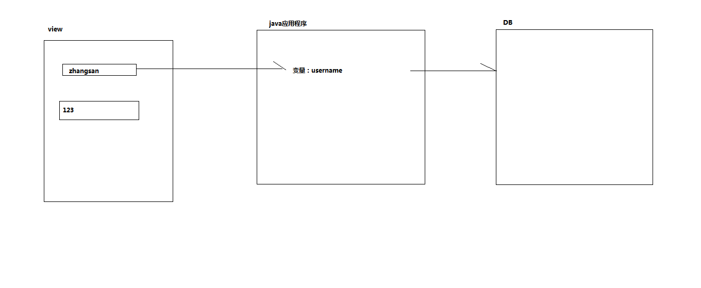
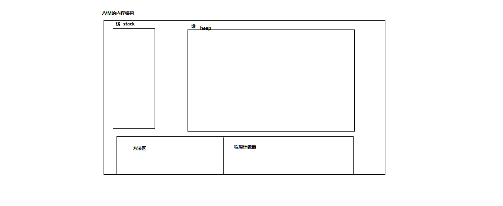
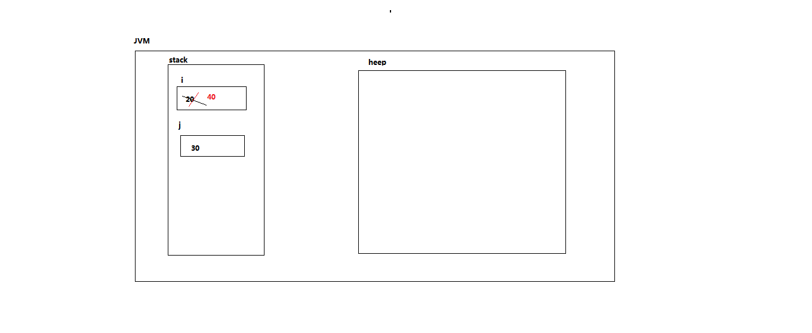
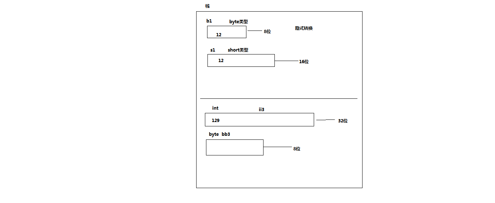

#  第二章：变量和运算符

- ## 关键字、保留字和标识符

  - **关键字**：java中已经使用的特殊的英文单词，对编译器有特殊意义，关键字不能用作变量名、方法名、类名、包名
  - **保留字**：对编译器有特殊意义的英文单词，java中还没有使用，以后用不用不知道。例如：goto
  - **标识符**:Java中的包、类、方法、参数和变量的名称总称为标识符
    - **标识符的命名规则**(必须遵守): 
      - 必须以字母、下划线（_）或美元符号（$）开头
      - 余下的字符可以是下划线、美元符号或任何的字母或数字，长度不限
      - 标识符中不能有空格；
      - 所有标识符的命名不能有中文和空格
      - 不能使用Java中的关键字或者保留字做为标识符
    - **标识符命名规范**（建议遵守）：
      - **包名**：域名.公司名.项目名.种类  例如：org.nesoft.javase.test
      - **类名**：驼峰命名法  _/\ _ /\  _   英文首字母大写其他字母小写  例如：UserTest           User_Test_My_Project
      - **变量和参数名**：驼峰命名法  _/\ _ /\  _   首字母小写其余英文单词首字母大写  getAge  get_age
      - **方法名**：驼峰命名法  _/\ _ /\  _   首字母小写其余英文单词首字母大写  getAge
      - **常量**:所有字母都要大写，每个英文单词之间使用“_”分隔

  

- ## 变量

  - **概念**：在程序运行过程中随时可能发生改变的量

    ​			变量是程序中数据的临时存放场所

    

  - **JVM的内存结构**

    

  - **变量的使用**：

    ```java
    	public static void main(String[] args) {
    //		变量的声明
    		int i;  //int :数据类型   i：变量
    //		变量的赋值
    		i=10;
    		System.out.println(i);
    		i=20;
    		System.out.println("i:"+i);
    //		变量的初始化(变量的第一次赋值，一般是变量声明的同时完成初始化)
    		int j=20; 
    		System.out.println("j:"+j);
    		j=30;
    		System.out.println("j:"+j);
    //		变量必须初始化之后才能使用
    		int m;
    //		System.out.println(m);
    		m=20;
    		System.out.println(m);
    		
    	}
    ```

    

  - **变量的内存**

    - **基本数据类型变量的数据存在栈区**

    

- ## 数据类型的分类

  - 基本数据类型

    - 数值型

      - 整型：byte、short、int、long

        ```java
        	public static void main(String[] args) {
        //		整型：byte、short、int、long
        //		byte  1字节 8位   -2^7~2^7-1(-128~127)
        		byte b1=12;
        		System.out.println("b1:"+b1); 
        //		b1=128;  编译不通过
        //		short 2字节 16位 -2^15~2^15-1
        		short s1=1234;
        		System.out.println("s1:"+s1);
        //		int   4字节 32位  -2^31~2^31-1
        //		int是java中默认的整型
        		int i1=123213;
        //	    i1=123123123123;编译不通过 超过int的大小
        		System.out.println("i1:"+i1);
        //		long  8字节  64位  -2^63~2^63-1
        //		声明long类型并给变量赋值时,该值末尾要加上L或者l
        		long l1=1231231;  //隐式转换 :int 转 long
        		System.out.println("l1:"+l1);
        		l1=1231231231231231L;
        		System.out.println("l1:"+l1);
        		
        //		十进制 (0~9) 第一位不能是0  
        		int i2=456;
        //		八进制(0~7)  必须以0开头    
        		i2=045; 	//5*8^0+4*8^1
        		System.out.println("i2:"+i2); //37
        		i2=012345;  //5*8^0+4*8^1+3*8^2+2*8^3+1*8^4
        		System.out.println("i2:"+i2);//5349
        //		十六进制  (0 ~ 9  A ~ F)  必须以0X或0x开头
        		i2=0x12AF; //15*16^0+10*16^1+2*16^2+1*16^3
        		System.out.println("i2:"+i2);//4783
        //		JDK7以前版本，没有二进制的整型常量写法，一般用十六进制代替
        //		JDK7之后 二进制 (0~1) 必须以0b或0B开头
        		i2=0b010110; // 0*2^0+1*2^1+1*2^2+0*2^3+1*2^4+0*2^5
        		System.out.println("i2:"+i2);//22
        //		由于JDK7以后版本数值常量增加对下划线支持，也可以写成：
        		i2=0B0101_0000_1010_0010_1101_0000_1010_0010;
        		System.out.println("i2:"+i2);//1352847522
        
        ```

      - 浮点型:float、double

        ```java
        		
        //		浮点型 float double
        		
        //		float(单精度--精确到小数点后四位) 4字节  32位      
        //		声明float类型并给变量赋值时,该值末尾要加上F或者f
        		float f1=1234.565677f;
        //		f1=1234.565677; 编译报错  1234.565677是double类型
        		System.out.println("f1:"+f1);//1234.5657
        		
        //		double(双精度--精确到小数点后8位) 8字节  64位
        //		double类型时java中默认的浮点型
        //		声明double类型并给变量赋值时,该值末尾可以加上d或者D,也可以不加
        		double d1=1234.565677; 
        		System.out.println("d1:"+d1);//d1:1234.565677
        ```

        

    - 字符型:char

      ```java
      //		字符类型 char
      //		Java中的字符类型的值通常用英文单引号括起来，代表单个字符
      		
      //		char能接受什么样类型的数据？
      //		接收单个字符
      		char c1='中';
      		System.out.println("c1:"+c1);
      		
      //		接收整数 只能接收16位整数  最小值:0, 最大值:65535 = 2^16-1
      //		JVM会去找到ascii码,将数值对应的ascii字符输出
      //		十进制
      		c1=0;
      		System.out.println("c1:"+c1);//空串
      		c1=49;
      		System.out.println("c1:"+c1);//1
      		c1=65;
      		System.out.println("c1:"+c1);//A
      //		十六进制
      		c1=0x22;
      		System.out.println("c1:"+c1);//"
      		
      //		接收Unicode字符 
      		c1='\u03A6';
      		System.out.println("c1:"+c1);//Φ
      		c1='\u2220';
      		System.out.println("c1:"+c1);//∠
      		c1='\u8680';
      		System.out.println("c1:"+c1);//蚀
      //		字符类型-转义字符
      //		使用输出语句，打印出带引号的信息如输出：你好"中国"
      		System.out.println("你好\"中国\"");//你好"中国" 
      		System.out.print("我爱你\n");
      		System.out.print("中国");
      		System.out.println("中\t\t国");
      ```

      

    - 布尔型:boolean

      ```java
      //		布尔型  boolean:只能接收两个值 true和false
      		boolean temp=true;
      		temp=1<2;
      		System.out.println("temp:"+temp);//true
      		temp=2<1;
      		System.out.println("temp:"+temp);//false
      
      ```

      

  - 引用数据类型：数组、接口、类(包括String)

- ## **基本数据类型转换**

  

  ```java
  //		隐式转换：①两种类型彼此兼容②目标类型的取值范围要大于源类型(简单来说小范围转大范围)
  		byte b1=12;
  		short s1=b1; // byte转short
  		System.out.println("s1:"+s1);
  		int i1=s1;	 //short转int
  		long l1=i1;  //int 转long
  		l1=213123;	//int 转long
  		double d1=1234.45f;// float 转 double
  //		浮点型的范围比整型的大 int<float  long<float float<double
  		float f2=12345;  //int 转float
  		System.out.println("f2:"+f2);//12345.0
  		f2=123123L;
  		System.out.println("f2:"+f2);//123123.0
  		
  //		在计算时byte、short、char之间不会相互转换，他们三者在计算时首先会转换为int类型
  		byte b2=10;
  		short s2=20;
  		char c2=49;//1
  		System.out.println("c2:"+c2); //1
  		int c3=c2;
  		System.out.println("c3:"+c3); //49
  		System.out.println("c2:"+(int)c2); //49
  		int s3=b2+s2+c2;
  		System.out.println("s3:"+s3); //79
  //		计算得到的最终结果的数据类型为计算数中最大的数据类型
  		double d2=12.4+123.5f+12;
  		System.out.println("d2:"+d2); //147.9
  
  //		显示转换(强制转换) :当两种类型彼此不兼容或者目标类型取值范围小于源类型(简单来说大范围转小范围)
  //		注意：大范围可以强制转小范围类型,但是容易精度丢失,后果自负
  //		    在强制类型转换过程中，源类型的值可能大于目标类型，因此可能造成精度降低或溢出，使用时需注意
  		int ii1=100;
  		byte bb1=(byte) ii1; // int 转 byte
  		System.out.println("bb1:"+bb1);//bb1:100
  		
  		float ff1=(float)123.45;// double 转 float
  		System.out.println("ff1:"+ff1);//ff1:123.45
  		
  //		float 转 int
  		int ii2=(int) ff1;
  		System.out.println(ii2);
  		
  //		java中以补码的形式存储数值型数据,当访问时将补码转为原码显示
  		/**
  		 * 最高位为符号位：整数是0  负数是1
  		 * 正数的原码和补码以及反码都是同一个数
  		 * 
  		 * 负数的反码：原码符号位不变其余取反
  		 * 负数的补码：反码+1
  		 * 
  		 * 负数补码转原码：
  		 * 	补码转反码：补码-1
  		 * 	反码转原码：原码符号位不变其余取反
  
  		 */
  		int ii3=129; //0000...1000 0001
  		byte bb3=(byte)ii3;  //补码：1000 0001  反码：1000 0000  原码：1111 1111
  		System.out.println("bb3:"+bb3);//-127
  		 
  		int ii4=9;//原码：0000...0000 1001 反码：0000...0000 1001 补码：0000...0000 1001
  		int ii5=-9;//原码：1000...0000 1001 反码：1111...1111 0110    补码： 1111...1111 0111
  		System.out.println("ii5:"+ii5);//-9
  	}
  ```

  

- ## 运算符

  - 是一种特殊的符号，用以表示数据的运算、赋值和比较

    ```java
    	public static void main(String[] args) {
    //		运算符的种类：
    //		赋值运算符：=、+=、﹣=、*=、/=、%=
    		int i=10;
    		System.out.println("i:"+i);
    		i+=20; //i=i+20
    		System.out.println("i:"+i);
    //		注意 ：求整时,结果的符号遵循 负负得正  负正得负
    		i/=4; // i=i/2  30/4
    		System.out.println("i:"+i);//7
    //		注意 ：求余时,结果的符号遵循 ：和被除数的符号一致
    		i%=4; // i=i%4  7%4
    		System.out.println("i:"+i);//3
    
    //		算术运算符： +、﹣、*、/、%、++、 --
    //		++ 自增   -- 自减
    		int i1=10;
    		i1++;
    		System.out.println("i1:"+i1);//11
    		i1--;
    		System.out.println("i1:"+i1);//10
    //		注意：如果++放在变量后面是先赋值给表达式,再计算；如果++放在变量前面是先计算得到结果后再赋值给表达式
    		int i2=10;
    		System.out.println(i2++);//10
    		System.out.println(i2); //11
    		int i3=i2++;
    		System.out.println(i3);//11
    		System.out.println(i2);//12
    		++i2;
    		System.out.println(i2);//13
    		int i4=++i2;
    		System.out.println(i4);//14
    		System.out.println(i2);//14
    		
    		int z=i4++;  
    		System.out.println(z);// z =14
    		System.out.println(i4); // i4=15
    		i4--;       
    		System.out.println(i4);//i4=14
    		i2=z-- + ++i4;  //14 + 15
    		System.out.println(i2); // 29
    		System.out.println(z); // 13
    		System.out.println(i4);// 15
    		i4=i2++/i4;
    		System.out.println(i4);//1
    		System.out.println("--------------------------------------------");
    //		比较运算符：>、<、>=、 <=、= =、!=、instanceof
    //		注意：运算的结果返回值为boolean
    		boolean t1= 1<2;
    		System.out.println("t1:"+t1);//t1:true
    //		== :用于基本数据类型比较时,比较的是两个值内容是否相等
    //		== :用于引用数据类型比较时，比较的是两个对象的物理地址是否相等(后面再讲解)
    		System.out.println(1==2);//false
    		System.out.println(4==4);//true
    //		!= 判断两个基本数据类型的内容是否不相同  或者引用数据用来非空判断
    		System.out.println(1!=2);//true
    		String username="zhangsan"; //引用数据类型
    		System.out.println(username!=null);//true
    		String password=null;
    		System.out.println(password!=null);//false
    //		instanceof 判断某个对象(引用数据类型)是否属于某一类型
    		System.out.println(username instanceof String);//true
    		Date d=new Date();
    		System.out.println(d instanceof Date);//true
    		System.out.println("--------------------------------------------");
    //		逻辑运算符：!、&&、||
    //		返回值是boolean值
    		
    //		&&与   表达式A&&表达式B  A和B都为true整个逻辑表达式才为true,否则为false
    //		注意：表达式A和表达式B的返回值必须为boolean
    		boolean t2=1<2 && 3<4;
    		System.out.println("t2:"+t2);//t2:true
    		t2=2<1 && 3<4;
    		System.out.println("t2:"+t2);//t2:false
    		
    		int money=20000;//存款
    		boolean home=true;//有房
    		boolean married =2000000<money && home;
    		System.out.println("married:"+married);//married:false
    		
    //		||或   表达式A||表达式B  A和B都为false整个逻辑表达式才为false,否则为true,A或B只要有一个为true整个表达式就为true	
    		t2=2<1 || 3<4;
    		System.out.println("t2:"+t2);//t2:true
    		t2=2<1 || 4<3;
    		System.out.println("t2:"+t2);//t2:false
    		married =2000000<money || home;
    		System.out.println("married:"+married);//married:true
    		
    //		! boolean取反  true取反为false  false取反为true
    		System.out.println(!(2000000<money || home));//false
    		System.out.println(!false);//true
    		
    //		位运算符： &、|、^ 、 ~、>>、<<、>>>
    //		计算功能：只对byte、short、char、int、long有效  需要将计算数转为二进制再计算
    //		按位 & ：只有参加运算的两位都为1，&运算的结果才为1，否则为0
    		int ii1=9&3;
    		/**
    		 *  1001
    		 *  0011
    		 *  0001
    		 * 
    		 */
    		System.out.println("ii1:"+ii1);//1
    //		按位 | ：只有参加运算的两位都为0，|运算的结果才为0，否则为1
    		/**
    		 *  1001
    		 *  0011
    		 *  1011
    		 * 
    		 */
    		ii1=9|3;
    		System.out.println("ii1:"+ii1);//11
    //		^ 异或  只有参加运算的两位不同，^运算的结果才为1，否则为0
    		/**
    		 *  1001
    		 *  0011
    		 *  1010
    		 * 
    		 */
    		ii1=9^3;
    		System.out.println("ii1:"+ii1);//10
    //		<<左移：a<<b,将a的二进制(补码)数据左移b位，右边移空的部分补0
    //		口令：a<<n  a*2^n
    //		注意：符号位一起移动  ,不管整数还是负数移动的都是补码
    		/**
    		 * 0000...0000 1001
    		 * 0000...0100 1000
    		 * 
    		 * -9的原码：
    		 * 1000...0000 1001
    		 * 反码：1111...1111 0110
    		 * 补码：1111...1111 0111
    		 * 左移三位：1111...1011 1000
    		 * 补码转反码：1111...1011 0111
    		 * 反码转原码：1000...0100 1000
    		 */
    		ii1=9<<3;
    		System.out.println("ii1:"+ii1);//72
    		ii1=-9<<3;
    		System.out.println("ii1:"+ii1);//-72
    		ii1=14<<5; 
    		System.out.println("ii1:"+ii1);//448
    
    //     >> 右移  a>>b,将a的二进制数据右移b位，如果最高位是0，则左边移空的部分补0，如果最高位是1，则左边移空的部分补1
    //		口令：a>>n 正数 a/2^n 负数：a/2^n-1
    		/**
    		 * 0000...0000 1001
    		 * 0000...0000 0001
    		 * 
    		 * -9的原码：
    		 * 1000...0000 1001
    		 * 反码：1111...1111 0110
    		 * 补码：1111...1111 0111
    		 * 右移三位：1111...1111 1110
    		 * 补码转反码：1111...1111 1101
    		 * 反码转原码：1000...0000 0010
    		 */
    		ii1=9>>3;
    		System.out.println("ii1:"+ii1);//1
    		ii1=-9>>3;
    		System.out.println("ii1:"+ii1);//-2
    		ii1=17>>2;
    		System.out.println("ii1:"+ii1);//4
    		ii1=-17>>2;
    		System.out.println("ii1:"+ii1);//-5
    		ii1=69>>2;
    		System.out.println("ii1:"+ii1);//17
    		ii1=-69>>2;
    		System.out.println("ii1:"+ii1);//-18
    //		条件运算符： ?：
    //		条件运算符很独特，因为它是用三个操作数组成的三元运算符。
            		
    //		位运算的逻辑功能和逻辑运算的逻辑功能的区别
    		int ii2=10;
    //		按位&和逻辑&&的区别:它们都有逻辑功能但是按位&没有短路功能,逻辑&&短路功能
		boolean temp=2<1 & 1<ii2++;
    		System.out.println("temp:"+temp+" ii2:"+ii2);
    		temp=2<1 && 1<ii2++;
    		System.out.println("temp:"+temp+" ii2:"+ii2);
    //		按位|和逻辑||的区别：它们都有逻辑功能但是按位|没有短路功能,逻辑||短路功能
    		temp=1<2 | 1<ii2++;
    		System.out.println("temp:"+temp+" ii2:"+ii2);
    		temp=1<2 || 1<ii2++;
    		System.out.println("temp:"+temp+" ii2:"+ii2);
    //		条件运算符： ?：相当于if{}else{}
    //		表达式A？表达式B：表达式C     如果A为true整个三元表达式的返回值为B，否者为C
    //		注意：表达式A的返回值必须为boolean值,B和C的数据类型必须一致,整个表达式的返回值为B或C的数据类型
    //		条件运算符很独特，因为它是用三个操作数组成的三元运算符。
    		char cc1 = 1<2?'是':'否';
    		System.out.println("cc1:"+cc1);
    		
    //		运算符的的优先级
    		int ii3=10;
    		boolean temp1=ii3++<20 && ii3+10<40;
    //		先运算 ++ 再到<  再到&& 再到 ？ 最后面才是=
    		temp1=ii3++<20 && ii3+10<40?true:false;
    		
    //		同等优先级的情况下：从左到右
    		int ii4=9*12/2;  //54
    //		同等优先级的情况下：从右到左
    		int ii5=-ii4++;
    		System.out.println(ii5);//-54
    //		同等优先级的情况下：赋值运算符和三目运算符都是从右往左运行
    		int ii6=19;
    		temp1=false?true:true?false:false?true:false?false:true?false:true;
    		System.out.println("temp1:"+temp1);
    		
    		int ii7=ii6--/ii6-10;
    		System.out.println(ii7);//-9
    		
    		 ii7=ii6--/(ii6-10);
    		System.out.println(ii7);//2
    
    
    	}
    
    ```
    
    - **表达式：表达式是符合一定语法规则的运算符和运算数的序列**	例如：i++;
    - **表达式的运算顺序:**
      - 应按照运算符的优先级从高到低的顺序进行
      - 优先级相同的运算符按照事先约定的结合方向进行
    
  - **运算符的优先级**：
  
    - 按操作数多少划分:()>一元操作符 > 二元操作符 > 三元操作符 >赋值运算符
  
      -  一元操作符：++，-- ，! 
  
      -  二元操作符： +  -  *  /    >、>=、<、<=、== 和 !=   &、^、|、&&、|| 
  
      -  三元操作符：? ：
  
    - 按运算类型划分：
  
      - ()>算术运算符 > 关系运算符 > 逻辑运算符 > 赋值运算符