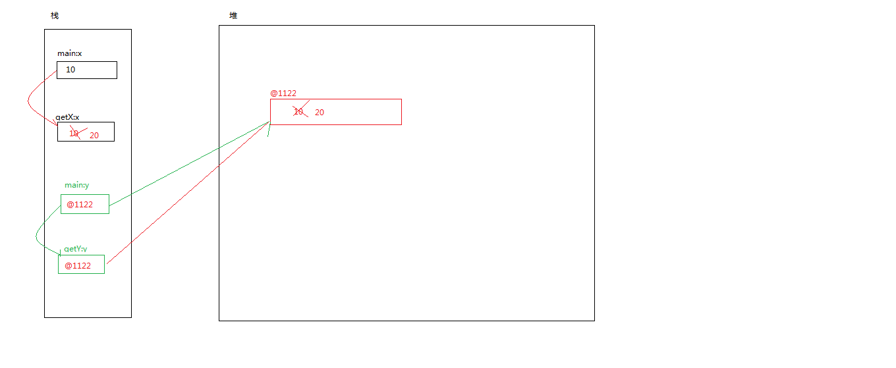

# 第五章：方法定义以及调用

- ## 方法的概念

  - **概述**：方法是完成某个功能的一组语句，通常将常用的功能写成一个方法
  - **作用**：可以实现代码的重用、简化了程序的编写和维护工作

- ## 方法的定义

  - 定义方法就是编写一段有特定功能的代码，在程序中使用同样功能的地方，没有必要重复编写同样的代码，只要调用定义好的方法就可以
    - [访问控制符] [修饰符] 返回值类型 方法名(参数类型 形式参数,参数类型 形式参数,…){
          代码;
          [返回值;]
      }

- ## 方法的分类

  - 无参无返回值

  - 无参有返回值

  - 有参无返回值

  - 有参有返回值

    ```java
    /**
     * 方法的分类
     * 
     * @author Administrator
     * 注意：
     * 	①方法是定义在类中，方法中不能再定义方法，一个类中可以定义多个方法
     *  
     *
     */
    public class MethodCategory {
    //	方法的定义
    	/**
    	 * 无参无返回值
    	 * void:表示这个方法没有返回值
    	 * getName：方法名
    	 */
    	public void getName() {
    		System.out.println("无参无返回值的方法");
    	}
    
    	/**
    	 * - 无参有返回值
    	 * String:标注这个方法的返回值的类型为String类型
    	 * getAddress:方法名
    	 * return：调用该方法得到的返回值
    	 * @return
    	 * 注意：
    	 * ①return的结果数据类型必须和方法声明时的数据类型保持一致，可以是变量也可以是常量
    	 * ②有返回值的方法必须执行return,而且只能执行一次retrun语句
    	 * ③return是方法的结束标志
    	 * ④返回值只能有一个
    	 */
    	public String getAddress() {
    		String address="东软";
    		if(1<2) {
    			return address;
    //			System.out.println("000"); 编译不通过
    		}
    		System.out.println("00000");
    		return address;
    	}
    
    	/**
    	 *  有参无返回值
    	 * @param name
    	 * name:形式参数  String：参数的数据类型
    	 *  注意：
    	 *  ①一个方法可以有多个参数,参数之间使用","隔开
    	 *  ②参数可以是基本数据类型也可以是引用数据类型
    	 *  ③形式参数是局部变量,其生命周期(作用域)在声明的方法体内
    	 *  ④参数在方法被调用时完成初始化工作
    	 */
    	public void getAge(String name) {
    		System.out.println(name+"有参无返回值的方法");
    	}
    	public void getSex(int age,int[] nos) {
    		System.out.println(age+"有参无返回值的方法");
    			
    	}
    	
    	/**
    	 *  有参有返回值
    	 * @param age 参数
    	 * @return :方法的返回值
    	 */
    	public int getEmpno(int age) {
    		age+=80;
    		return age;	
    		
    	};
    	public String getEname(int age) {
    		
    		return null;	
    		
    	};
    
    	public static void main(String[] args) {
    
    	}
    
    ```

    

- ## 方法的调用

  - **概述**：所谓调用方法，其实就是给方法的入口传入一些值（参数），然后在出口得到方法执行的结果

  - **注意**：

    - 方法中的语句块一定是被调用之后才能生效
    - 同一个方法可以被多次调用

  - ```java
    /**
     * 方法的调用
     * @author Administrator
     *	注意：
     *		①方法中的语句块一定是被调用之后才能生效
     *		②同一个方法可以被多次调用
     *什么时候声明无返回值的方法？什么时候声明成有返回值的方法？
     * 当你执行执行方法中的代码块或者该方法只执行某些代码片段不需要得到一个结果时可以声明成无返回值的方法
     * 如果想调用方法后得到结果再对该结果进行下一步操作时可以声明成有返回值的方法
     */
    public class MethodCall {
    	/**
    	 * 无参无返回值方法的调用 
    	 * 不需要传入参数也没有返回值
    	 */
    	public static void getName() {
    		System.out.println("无参无返回值");
    	}
    	/**
    	 * 调用有参的方法
    	 * 注意：
    	 * 	①实参和形参的数量、类型、顺序必须匹配
    	 * 	②实参直接在括号中，不需要类型声明,实参可以是变量也可以是常量
    	 * @param age
    	 */
    	public static void getAddress(int age) {
    		age+=20;
    		System.out.println("有参无返回值"+age);
    	}
    	public static void getSex(int age,String name) {
    		
    		System.out.println("有参无返回值"+age+":"+name);
    	}
    	/**
    	 *  有参有返回值方法调用
    	 * @param args
    	 * 
    	 *  注意:如果方法有返回值，调用方法可以得到该方法的返回值，然后赋值给与方法返回值类型相同的变量
    	 */
    	public static String getEname(int enmpno) {
    		System.out.println("根据雇员编号查询雇员姓名");
    		String name="scott";
    		return name;
    	}
    	public static double getSal(int enmpno,String name) {
    		
    //		String name="scott";//在同一个作用域中变量不能重复定义
    		return 90.0;
    	}
    
    	public static void main(String[] args) {
    		System.out.println("方法的调用");
    		getName();
    //		getName();
    		getAddress(1);//1 是实参
    		int age=30;
    		getAddress(age);// age是实参
    		int a=20;
    		getAddress(a); //a是实参
    		
    //		getAddress(a,"zhangsan"); 数量必须匹配
    //		getAddress("zhangsan");   类型必须匹配
    		
    		getSex(20,"zhangsan");
    //		getSex("zhangsan",20); 类型必须匹配
    		
    		String ename=getEname(7788);
    		System.out.println("ename:"+ename);
    		System.out.println(getEname(1));
    		
    		double sal=getSal(89, "lisi");
    		System.out.println(sal);
    		if(20<sal) {
    			System.out.println("高收入人群");
    		}
    		
    	}
    ```

- # java中参数的传递

  - 方法的参数可以是基本数据类型也可以是引用数据类型

  - java中的值传递

    

    ```java
    /**
     * 值传递：
     * 	值传递（pass by value）是指在调用函数时将实际参数【复制】一份传递到函数中，
     * 	这样在函数中如果对参数进行修改，将不会影响到实际参数
     *引用传递（pass by reference）是指在调用函数时将实际参数的地址【直接】传递到函数中，
     *	那么在函数中对参数所进行的修改，将影响到实际参数。 
     * @author Administrator
     *
     */
    public class MethodArgs {
    	/**
    	 * 
    	 * @param x 基本数据类型
    	 */
    	public static void getX(int x) {
    		x=x+10;
    	}
    	/**
    	 * 
    	 * @param y 引用数据类型
    	 */
    	public static void getY(int[] y) {
    		y[0]=y[0]+10;
    	}
    
    
    	public static void main(String[] args) {
    		int x=10;
    		System.out.println("调用方法前："+x);//10
    		getX(x);
    		System.out.println("调用方法后："+x);//10
    		int[] y= {10};
    		System.out.println("调用方法前："+y[0]);//10
    		getY(y);
    		System.out.println("调用方法前："+y[0]);//20
    		
    	}
    
    ```

- ## 方法的递归

  - 概述：方法自己调用自己

  - 特点：方法递归包含了一种隐式的循环，它会重复执行某段代码，但这种重复执行无须循环控制

    

- ## 方法的重载

  - 概述：在同一个类中相同的方法名有不同的功能
  - 注意：在同一个类中不能有相同的方法

  ```java
  /**
   * 方法重载：
   * 	前提：在同一个类中
   * 	规则：
   * 		一同一不同
   * 		方法名相同，参数列表不同
   * 		①方法名必须相同
   * 		②参数的类型不同或者参数的个数不同
   * 		③返回值可同可不同
   * 
   * @author Administrator
   *
   */
  public class MethodOverLoad {
  	
  	public  void getName() {
  		System.out.println("getName()");
  	}
  	
  	public  void getName(int age) {
  		System.out.println("getName(int age)"+age);
  	}
  	
  	public  void getName(String name) {
  		System.out.println("getName(int age)"+name);
  	}
  	
  	public  void getName(String name,int age) {
  		System.out.println("getName(int age)"+name+":"+age);
  	}
  	
  	public  String getName(int age,String name) {
  		System.out.println("getName(int age)"+name+":"+age);
  		return name;
  	}
  	
  	public static void main(String[] args) {
  //		实例化之后才能调用成员方法
  		MethodOverLoad ol=new MethodOverLoad();
  		ol.getName();
  		ol.getName(10);
  		ol.getName("zhangsan");
  
  	}
  
  }
  ```

  