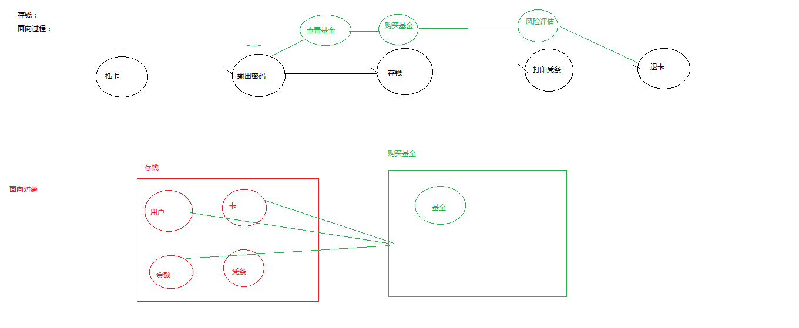
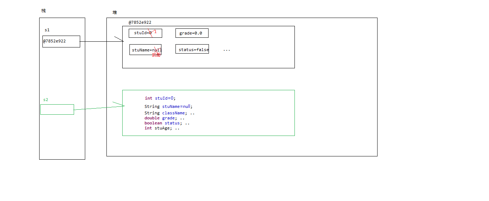
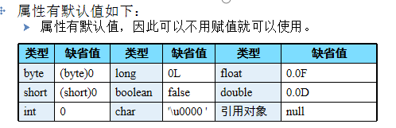
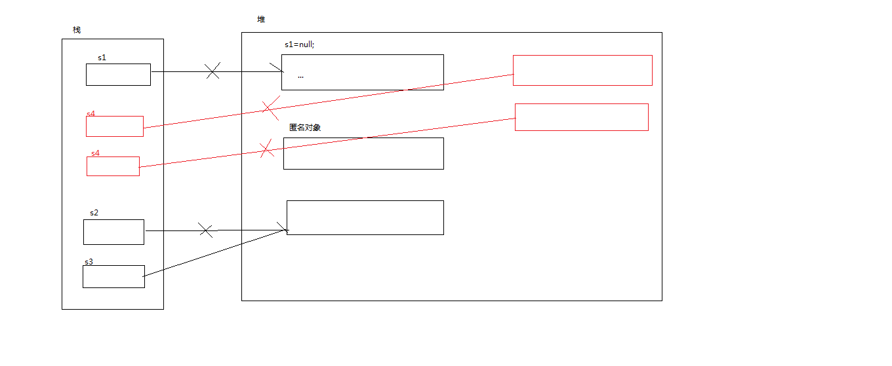
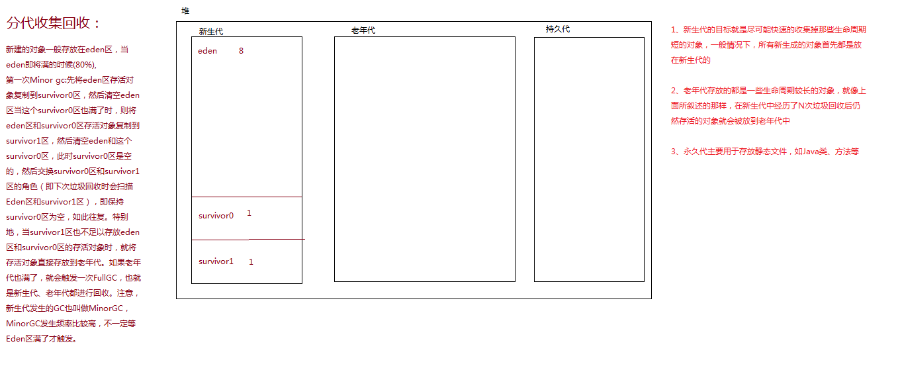
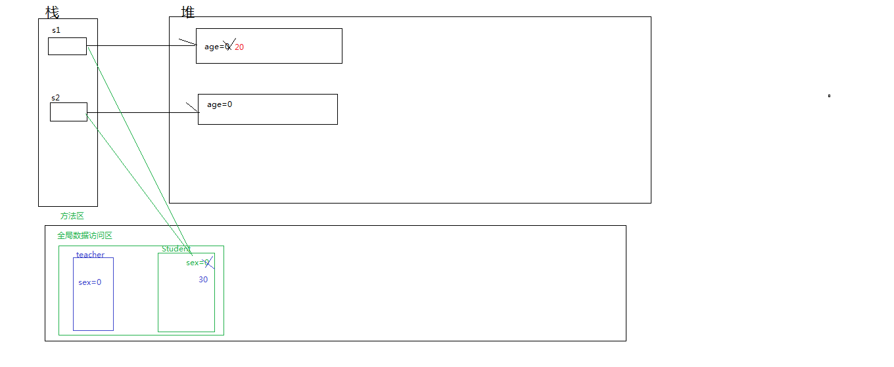
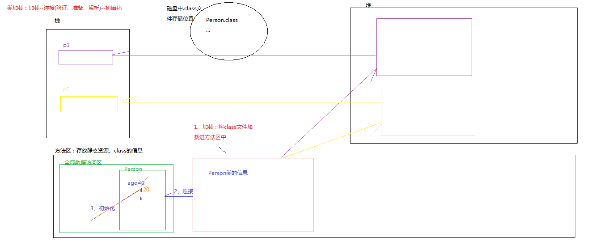
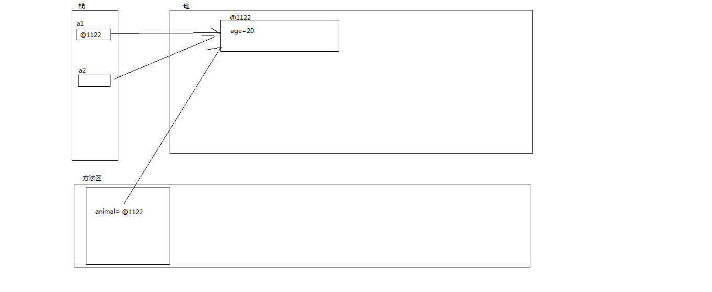

# 第六章：面向对象编程基础

- **抽象**：由具体到抽象，由复杂到简单的过程称为抽象，简单来说就是将复杂的问题简单化。

- **面向过程和面向对象的区别：**

  - 面向过程的概念： 面向过程是一种以过程为中心的编程思想 

  - 面向过程的抽象： 就是分析出解决问题所需要的步骤，然后用函数把这些步骤一步一步实现，使用的时候一个一个依次调用就可以了。 

  - 面向对象的概念： 是一种以事物为中心的编程思想 

  - 面向对象的抽象：强调直接以问题域中的事物为中心来思考问题，认识问题，并根据这些事物的本质特点，把它们抽象地表示为系统中的对象，作为系统的基本构成单位。从事物中舍弃个别的非本质特征，抽取共同的本质特征，只考虑与问题域相关的信息，而忽略与问题域不相关的部分

    

- ## **面向对象编程**

  - **面向对象编程包括**

    - 面向对象的分析（OOA，Object Oriented Analysis）

    - 面向对象的设计（OOD，Object Oriented Design）

    - 面向对象的编程实现(OOP)

- ## 面向对象的概念

  - **类（class）：**
    类是一组具有相同属性和行为的对象的抽象，类的作用是用来创建对象，对象是类的一个实例
  - **类和对象的关系**
    抽象和具体的关系。
    每一个类在某一时刻都有零个或更多的实例， 类是生成对象的模板
    一个类定义了使用哪些数据来描述属性，每一个对象都有相应的属性值数据，一个类通过一系列方法来定义行为，这些方法能在每个对象中被激活

- ## 对象的内存分析

  

  - **对象的创建**：

    - 对象也称为实例

    - 使用new创建一个对象

    - 语法：类名   对象名 = new   类名();  1、JVM分配内存   2、初始化对象  3、将分配的内存地址传给声明的变量

    - 在栈内保存对象的首地址，即引用；

    - 在堆内存中保存了对象的属性。

    - 除了8种基本数据类型的变量，其他变量都是引用类型变量

    - 创建匿名对象：

      ```java
      //		如果只使用该对象进行一次方法或属性调用，可以创建匿名对象。
      //		创建匿名对象  :节省内存
      		new Student();
      //		创建完对象，在调用该对象的属性或方法时，也可以不定义对象的句柄，而直接调用这个对象的方法。这样的对象叫匿名对象
      		new Student().stuName="zhangsan";
      		System.out.println(new Student().stuName);//null
      		new Student().getName();
      
      ```

      

- ## 成员变量和成员方法

  ​	

  - **student.java**

    ```java
    /**
     * 	变量必须初始化的时候才能被访问
     * 
     * 	当对象创建的同时完成了对象的初始化工作
     *  访问属性(成员变量)：
     *  	通过对象的引用(变量)加" ." 点运算符访问
     * 访问成员方法
     * 		成员方法初始化之后才能被调用,通过对象的引用(变量)加" ." 点运算符访问 
     *       注意：成员方法能直接访问成员变量
     * 		成员变量的作用域范围：在整个类中生效
     * 		局部变量能和成员变量同名
     * 		如果成员变量和局部变量同名怎么办?  使用this关键字规定变量是成员变量     
     *		this：当前实例化对象
     */
    public class Student {
    //	属性(成员变量)
    	int stuId;
    	String stuName;
    	String className;
    	double grade;
    	boolean status;
    	int stuAge;
    //	成员方法
    	public void study() {
    		System.out.println("学生学习"+stuName);
    	}
    	
    	public String getName() {
    		String stuName="zhangsan";
    //		使用this区分成员变量和局部变量
    		System.out.println("查询学生姓名"+this.stuName);
    		System.out.println("查询学生姓名"+stuName);
    		return null;
    	}
    }
    ```

  - **TestStudent.java**

    ```java
    public class TestStudent {
    	public static void main(String[] args) {
    //		创建一个student对象
    		/**
    		 * new:内存空间分配符，在堆内存中创建对象
    		 */
    		Student s1=new Student();
    		Student s2=new Student();
    		System.out.println(s1.stuId);// 0
    		System.out.println(s1.stuName);// null
    		System.out.println(s1.grade); //0.0
    		System.out.println(s1.status);//false
    		System.out.println(s1);
    		s1.study();
    //		成员变量的赋值 
    //		注意：赋值的数据类型要与成员变量的数据类型一致
    		s1.stuId=1;
    		s1.stuName="凯哥";
    		s1.grade=90.0;
    		s1.status=true;
    		System.out.println(s1.stuId);// 1
    		System.out.println(s1.stuName);// 凯哥
    		System.out.println(s1.grade); //90.0
    		System.out.println(s1.status);//true
    		s1.study();
    		
    		System.out.println("s1-------------------");
    //		s1.study();
    		System.out.println("s2-------------------");
    		System.out.println(s2.status);//false
    		s2.stuName="lisi";
    		s2.study();
    		
    		s2.getName();
    		s1.getName();	
    	}
    ```

- ## 成员变量和局部变量的区别

  ```java
  /**
   * 区别：
   * 局部变量：方法体中声明的变量、方法中的参数或代码块中声明的变量，都是局部变量,作用域范围在代码块中
   * 成员变量：在类中声明的变量，作用域访问在整个类中
   * 属性可以和局部变量同名，使用关键字this进行区分
    局部变量必须先声明，然后才能使用
    属性在整个类中生效，无论在什么地方声明
   * 	
  
  
   * 
   * @author Administrator
   *
   */
  public class Teacher {
  	int age;//成员变量
  	
  	public void getAge(int number) {
  		
  		int sex=1;//局部变量
  		if(true) {
  			String TeaName="zhangsan";//局部变量
  		}
  		System.out.println(sex);
  		System.out.println(age);
  	}
  
  	public static void main(String[] args) {
  
  	}
  
  }
  ```

  

- ## 垃圾回收机制

  - 标记-清除算法、复制算法、标记整理算法、分代收集算法

  - 当没有对象引用指向原先分配给某个对象的内存时，该内存便成为垃圾。JVM的一个系统级线程会自动释放该内存块，简单来说就是没有引用执行该对象时该对象就会被识别成垃圾，垃圾回收线程将其回收

  - 垃圾回收机制作用于堆内存，与栈内存无关。

  - 垃圾回收机制是JVM内部运行的一个优先级比较低的后台线程，自动进行垃圾回收

    - 对象的引用被赋值为null

    - 使用的匿名对象

    - 超出生命周期的:创建了100个对象，循环赋值给变量p，每结束一次循环，变量p就超出生命周期，对象变为垃圾。

      ```java
      for( int i = 0; i< 100; i++){
      		Person p = new Person( );
      	  }	
      ```

      

      

      ​		

- ## 构造方法

  ```java
  **
   * 构造器(构造方法)：初始化对象
   * 	构造方法也是方法，但是它是特殊的方法而已
  	所有的对象都是通过构造器来初始化的
  	对象创建完成时也完成了初始化工作
   * 
   * 特点:
   * 	①没有返回值也没有void
   * 	②方法名和类名一样
   * 	③不能在方法中用return语句返回一个值
   *注意：
   *	①在Java中，每个类都至少要有一个构造器
   *	②当一个类中没有构造方法时,编译器会默认调加一个无参的构造方法
   *	③构造方法可以重载,如果一个类中有了构造方法那么编译器不会再自动提供无参构造方法，一般我们会自己提供无参构造方法
   * 	④调用无参构造方法可以初始化对象赋默认值给成员变量，调用有参构造方法也可以完成对象初始化同时可完成成员变量的赋值
   * @author Administrator
   *
   */
  public class Student {
  	String stuName;
  	int age;
  	double grade;
  
  //	无参构造方法
  	public Student() {
  		System.out.println("无参构造器");
  	}
  	
  	public Student(int age) {
  		System.out.println("有参的构造方法");
  	}
  //	有参构造方法的作用：初始化对象的同时完成成员变量的赋值(自定义的值)
  	public Student(int age,double grade,String stuName) {
  		this.stuName=stuName;
  		this.age=age;
  		this.grade=grade;
  		
  	}
  	
  //	public void Student() {
  //		System.out.println("成员方法");
  //	}
  //	构造代码块(成员代码块)
  	{
  //		stuName="zhangsan";
  		System.out.println("构造代码块");
  	}
  	
  	public String getResult() {
  		return "["+stuName+","+age+","+grade+"]";
  	}
  	
  	public static void main(String[] args) {
  		/**
  		 * new:内存空间分配符
  		 * Student():调用构造方法
  		 */
  		Student s1=new Student(10);
  		s1.age=20;
  		s1.stuName="zhangsan";
  		s1.grade=90.9;
  		
  		System.out.println("s1:"+s1.getResult());
  		Student s2=new Student(10);
  		System.out.println("s2:"+s2.getResult());
  		
  		Student s3=new Student(20,99.99,"lisi");
  		System.out.println("s3:"+s3.getResult());
  		
      }
  }
  ```

  


- ## Java包的概念

  - **用途**
    
    - 包允许将类组合成较小的单元 
    - 有助于避免命名冲突 
  - 包允许在更广的范围内保护类、数据和方法 
    
  - **注意**：
    
    - 在java中位于包中的类，在文件系统中的存放位置，
    
      必须有与包名层次相对应的目录结构
    - package语句作为java源文件的第一条语句
    - 每个源文件只能声明一个包
    - 如果没有package语句，则默认为无名包
    - Java类库中常用的包
      java.lang：Java默认包，任何程序中，该包都被自动导入。
      java.io：输入/输出操作有用的类的组成。
  - **访问不同包中的类**
    
    - 使用import关键字引入其它包中的类
    - 必须在package声明后面，类声明前面
    - import语句可以出现多次

- ## static关键字

  

  ```java
  public class TestStudent {
  
  	public static void main(String[] args) {
  //		Student.sex=30;
  		Student s1=new Student();
  		s1.age=20;
  //		s1.sex=30;
  		s1.getName();
  //		System.out.println("s1 age："+s1.age);//20
  //		System.out.println("s1 sex："+s1.sex);//30
  //		s1.getSex();
  //		Student.getSex();
  		Student.getSex();
  		
  		
  //		Student s2=new Student();
  //		System.out.println("s2 age："+s2.age);//0
  //		System.out.println("s2 sex："+s2.sex);//30
  //		s2.getSex();
  //		Student.getSex();
  		
  //		System.out.println(Teacher.sex);
  		
  
  	}
  
  }
  ```

  

```java
/**
 * 成员方法和成员变量声明在类中,必须实例化之后才能调用,成员方法可以直接调用成员变量个方法
 *静态方法和静态变量声明在类中,类加载的时候完成初始化
	 * 静态变量和非静态变量的区别是：静态变量被所有的对象所共享，在内存中只有一个副本，
	 * 它当且仅当在类初次加载时会被初始化。而非静态变量是对象所拥有的，在创建对象的时候被初始化
	 * ，存在多个副本，各个对象拥有的副本互不影响
 * static:静态   所有对象共享,类级别
 * 	 修饰的元素：
 *   	修饰变量：静态变量(类变量)
 *   		访问：
 *   			①实例化后使用引用加"."点运算符访问
 *   			②通过类名加"."运算符直接访问
 *   	修饰方法：静态方法(类方法)
 *   			①实例化后使用引用加"."点运算符访问
 *   			②通过类名加"."运算符直接访问
 *   
 *   	修饰代码块：静态代码块
 * 
 * 注意：①用static修饰的变量，它们在类被载入时创建，只要类存在，static变量就存在。 
 * 	  ②类加载只会执行一次，而可以实例化多次
 * 	  ③类加载是在对象实例化之前就完成了，类加载是完成了静态资源(静态变量和静态方法)的初始化
 * @author Administrator
 *特别注意：
 *	  ①成员方法能直接访问成员方法和成员变量
 *	  ②成员方法能直接调用静态方法和静态变量
 *	  ③静态方法不能直接调用成员方法和成员变量
 *	  ④静态方法能直接调用静态方法和静态变量
 *	  ⑤在静态方法中不能使用this和super关键字
 *	  ⑥static不能修饰构造器
 *
 */
public class Student {
//	成员变量
	int age;
//	静态变量
	static int sex;
	
//	成员方法
	public void getName() {
		this.age=20;//当前实例化对象
		System.out.println("成员方法"+",age:"+age+",sex"+sex);
		getSex();
	}
//  静态方法
	public static void getSex() {
//		this.age 在静态方法中不能使用this和super关键字
//		System.out.println(age);//编译不通过
//		getName();//编译不通过
		System.out.println("静态方法"+sex);
	}
	
	public static void main(String[] args) {
//		System.out.println(Student.sex); //0
		
	}

}
```

- ## 类加载过程：

  ​	

  - **加载：**将磁盘中的.class文件加载进内存(方法区)

  - **连接**：

    - 验证：验证加载进内存中的类的正确性
    - 准备： 为类的静态变量分配内存，并将其赋默认值 
    - 解析：将常量池中的符号引用替换为直接引用（内存地址）的过程 

    

  - **初始化**：给静态变量赋值

    ```java
    /**
     *  静态资源在类加载的时候就完成了初始化
     *  类加载只进行一次而可以实例化多次
     * 	静态代码块：给静态变量赋值
     * @author Administrator
     *
     */
    public class Person {
    	static int age;
    	String name;
    	Student stu=new Student();
    //	静态代码块
    	static {
    		age=20;
    		System.out.println("静态代码块");
    	}
    //	构造代码块
    	{
    		System.out.println("构造代码块");
    		
    	}
    //	构造方法
    	public Person() {
    		
    		System.out.println("构造方法");
    	}
    	public static void main(String[] args) {
    //		Person p=new Person();
    //		Person p1=new Person();
    //		Person p2=new Person();
    		
    		Teacher t=new Teacher();
    	
    //		System.out.println(age);
    	}
    
    ```

    

- ## 单例模式

  ​	

  - **概述**：保证一个类在内存中只存在一个实例

  - **作用**：节省内存

    ```java
    /**
     * 	private:修饰的变量和方法只能在本类中使用
     * 	 public：修饰变量和方法能在所有类中使用
     *  单例模式：
     *  	规则：
     *  		①提供一个私有的构造器
     *  		②声明一个私有的、静态的、自身变量
     *  		③提供一个全局访问点
     * 
     * 注意：单例模式的类建议不要有成员变量，不然会出现并发操作数据不一致问题
     * 使用场景：当类中都是行为时可以将该类变成单例模式或者该类中的成员变量不发生修改时
     * 、	
     * @author Administrator
     *
     */
    public class Animal {
    //	int age;
    //	私有构造器
    	private Animal() {
    		System.out.println("构造方法");
    	}
    //	声明一个私有的、静态的、自身属性
    	private static Animal animal=new Animal();
    //	提供一个全局访问点：static修饰，返回值为当前类的类型  懒汉式
    //	public static Animal getAnimalInstacne() {
    //		if(animal==null) {
    //			animal=new Animal();
    //		}
    //		return animal;
    //	}
    //	饿汉式
    	public static Animal getAnimalInstacne() {
    		return animal;
    		
    	}
    ```

    

    ​		