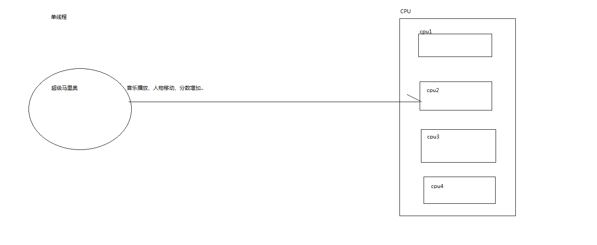
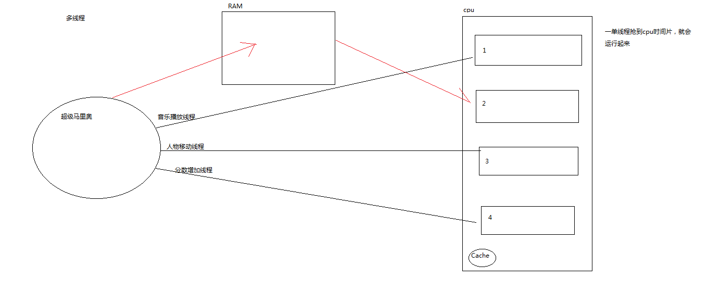
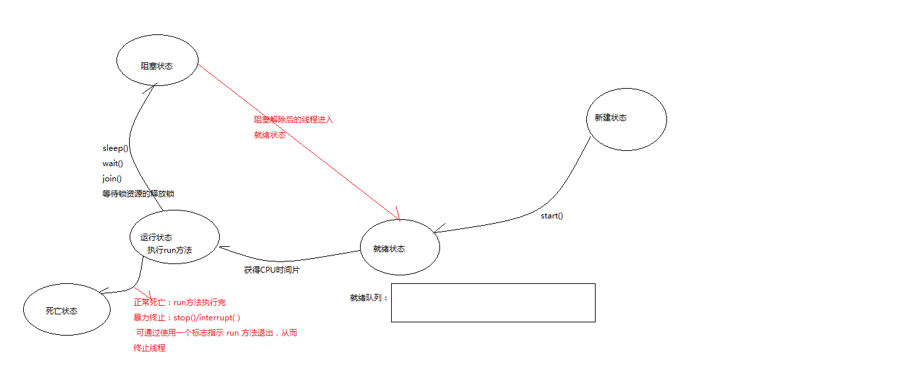
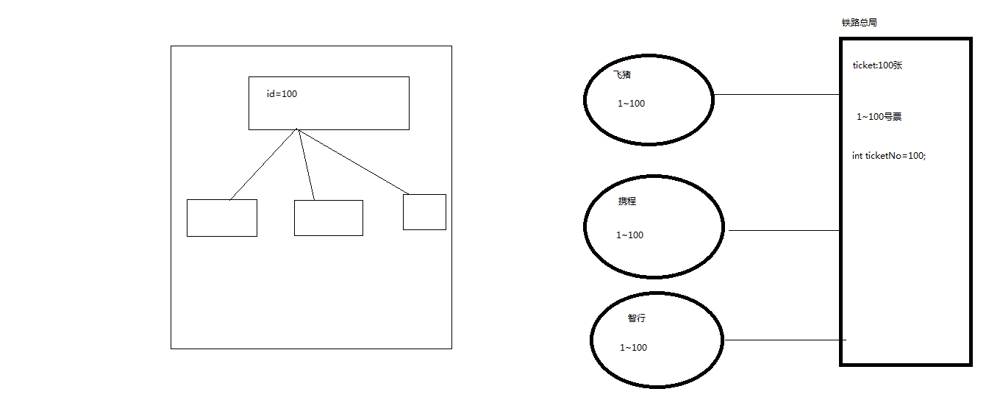
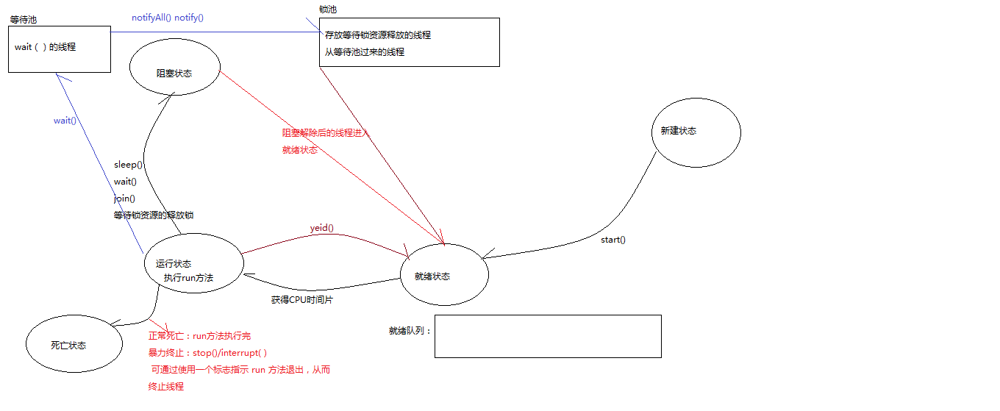

# 第十三章：多线程

- 在我们认识的操作系统中，大多数都是多用户多任务的，例如：Windows,Linux,Unix,mac....

- 多任务：在同一时间计算机上可以同时执行多个程序

- 进程：在计算机中运行的程序

- 线程：一个程序内部的顺序控制流，一个进程中可以包含一个或多个线程，一个线程就是一个程序内部的一条执行线索

- 多线程：在一个程序运行过程中多条线程同时运行(在同一应用程序中有多个顺序流同时执行)

- 多线程的作用：提高用户体验

  

  

- **多线程的创建**

  - **方式一：继承Thread类**

    - 让一个类继承Thread类

    - 重写Thread类中的run方法，在run方法中编写业务逻辑代码

    - 实例化该线程对象，并调用start()方法

    - 核心代码：

      ```java
      public class TestTheadOne  extends Thread{
      	@Override
      	public void run() {//线程跑起来真正干活的是run方法
      		for(int i=0;i<100;i++) {
      			System.out.println(Thread.currentThread().getName()+"人物移动");
      		}
      	}
      }
      
      TestTheadOne t1=new TestTheadOne();
      //让线程进入就绪队列，可以抢cpu时间片(让该线程有获得cpu时间片的机会)
      t1.start();
      ```

      

  - **方式二：实现Runnable接口**(建议)

    - 让一个类实现Runnable接口

    - 重写run方法，在run方法中编写业务逻辑代码

    - 先实例化该线程对象，将该线程对象作为参数传给Thread并创建其对象，调用start()方法

    - 核心代码：

      ```java
      public class TestRunnableOne implements Runnable{
      
      	@Override
      	public void run() {
      		for(int i=0;i<100;i++) {
      			System.out.println(Thread.currentThread().getName()+"人物移动");
      		}
      		
      	}
      }
      
      //		实例化线程对象
      		TestRunnableOne one=new TestRunnableOne();
      //		one.run();//这样调用run方法并不是创建线程,而是调用一个成员方法而已
      		Thread t1=new Thread(one);
      		t1.start();
      ```

      

- **线程的生命周期**

  - 新建状态：刚被创建的线程对象，还没有获得cpu时间片的机会
  - 就绪状态
  - 运行状态
  - 阻塞状态
  - 死亡状态

  

- **线程的方法**

  ```java
  public static void main(String[] args) throws InterruptedException {
  		TestTheadOne t1=new TestTheadOne();
  		t1.start();
  		Thread.sleep(1000);
  		for(int i=0;i<100;i++) {
  			System.out.println(Thread.currentThread().getName()+"播放音乐11"+i);
  		}
  //		t1.setPriority(10);
  //		注意：通过setPriority()设置线程的优先级只是让线程获得时间片的概率改变而已并不是绝对的得到cpu时间片
  //		t1.setPriority(Thread.MAX_PRIORITY);//如果优先级比较高只是获得cpu时间片的概率大一点而已
  //		设置和获取线程的优先级:新建的线程优先级都为5   getPriority()的数值越大优先级越高
  //		System.out.println(t1.getPriority());//10
  		TestTheadTwo t2=new TestTheadTwo();
  		t2.start();
  //		System.out.println(t2.getPriority());//5 
  		
  //		判断线程是否还活着
  //		System.out.println(t1.isAlive());
  //		sleep(mills) 指定线程睡眠时间，会使线程进入阻塞状态，不会释放锁资源
  	}
  
  ```

  

```java
/**
 * join()：该方法只会让主线程进入阻塞状态
 * 
 *    我们把调用join的线程称为副线程,让主线程进入阻塞状态等待副线程执行完后主线程阻塞才接除
 * 注意：必须调用start方法后再调用join()方法，join()方法才生效
 * @author Administrator
 *
 */
public class TestJoinAndYeid {
	public static void main(String[] args) throws InterruptedException  {
		
		TestTheadOne t1=new TestTheadOne();
		t1.start();
//		t1.yield();//让出cpu，进入就绪队列，使线程优先级比较高的线程获得cpu时间片
//		t1.join();//会让main进入阻塞状态，等待t1执行完main才解除阻塞
		TestTheadTwo t2=new TestTheadTwo();
		t2.start();
		
		for(int i=0;i<100;i++) {
			System.out.println(Thread.currentThread().getName()+"发送弹幕main"+i);
		}
		
		
	}

}
```

- 线程同步：

  - 并发：同一时间不同的线程对同一对象操作
  - 并发问题：同一时间不同的线程对同一对象操作出行数据不一致问题

  ```java
  /**
   *   铁路局老大
   * @author Administrator
   *
   */
  public class Ticket {
  //	一开始规定只有100张票  1~100号
  	int ticketNo=100;
  //	一把真正的锁
  	private Lock lock=new ReentrantLock();
  	
  //	当上锁之后，只有获得锁资源的线程才能执行，其他线程需要操作这些锁起来的代码或方法必须等待(阻塞)持有锁资源的线程释放锁资源后才能执行
  	
  //	售票方法
  	/**
  	 * synchronized:同步--保证数据同步
  	 *   锁方法，粒度较大
  	 *   锁方法：在方法上加synchronized关键字
  	 *   当方法执行完之后释放锁资源
  	 */
  //	public synchronized void saleTicket() {
  //		System.out.println(Thread.currentThread().getName()+"一万行代码");
  //		while(0<ticketNo) {// 0:100  1:100
  //			System.out.println(Thread.currentThread().getName()+"卖了"+ticketNo+"号票");
  //			ticketNo--;//0:92
  //		}
  //	}
  	/**
  	 * 锁对象：锁代码块，将出现并发问题的代码锁起来，粒度小
  	 * 当锁的代码块执行完之后才释放锁资源
  	 * 	
  	 */
  //	public  void saleTicket() {
  //		System.out.println(Thread.currentThread().getName()+"一万行代码");
  //		synchronized(this) {
  //		while(0<ticketNo) {// 0:100  1:100
  //			System.out.println(Thread.currentThread().getName()+"卖了"+ticketNo+"号票");
  //			ticketNo--;//0:92
  //		}
  //	}
  //}
  	/**
  	 * 锁：jdk面向对象编程提供了一把真正的锁
  	 */
  	public  void saleTicket() {
  	System.out.println(Thread.currentThread().getName()+"一万行代码");
  	lock.lock();//上锁
  	while(0<ticketNo) {// 0:100  1:100
  //		try {
  //			Thread.sleep(1000);//不释放锁资源
  //		} catch (InterruptedException e) {
  //			// TODO Auto-generated catch block
  //			e.printStackTrace();
  //		}
  		System.out.println(Thread.currentThread().getName()+"卖了"+ticketNo+"号票");
  		ticketNo--;//0:92
  	}
  	lock.unlock();//解锁
  
  } 
  
  }
  ```

  
  
  

- 线程通信(wait()、notify()/notifyAll())

  ```java
  /**
   * 面包房
   * @author Administrator
   *wait():会使当前线程进入阻塞状态，没有其他线程唤醒它，它就会一直阻塞
   *notify()：唤醒当前等待的一个线程，唤醒谁不清楚
   *notifyAll():唤醒所有等待的线程
   *
   *注意：notify()和notifyAll()以及wait()在synchronized保护的方法或者代码块中才生效否者会抛出异常IllegalMonitorStateException
   *		sleep()和wait()方法的区别：
   *		sleep():不会是释放锁资源,是Thread类的方法
   *		wait():会释放锁资源,是Object中的方法
   *		
   */
  public class Bread {
  //	一开始规定没有面包
  	private boolean flag=false;
  	
  //	生产方法
  	public synchronized void product() {
  		/**
  		 * 没有面包就生产
  		 */
  		if(!flag) {
  			System.out.println(Thread.currentThread().getName()+"生产了面包");
  			flag=true;
  			
  		}else {
  			System.out.println(Thread.currentThread().getName()+"快去消费吧");
  			try {
  //				notify();//唤醒正在等待的线程
  //				如果有了面包那么等待消费
  				wait();//这个方法会使当前线程进入阻塞状态，没有其他线程唤醒它，它就会一直阻塞
  //				Thread.sleep(10000000);
  //				阻塞之后的代码不会执行
  				System.out.println("生产阻塞解除");
  			} catch (InterruptedException e) {
  				e.printStackTrace();
  			}
  		}
  	}
  //	消费方法
  	public synchronized void buy() {
  		/**
  		 * 有面包就消费
  		 */
  		if(flag) {
  			System.out.println(Thread.currentThread().getName()+"消费了面包");
  			flag=false;
  			
  		}else {
  			System.out.println(Thread.currentThread().getName()+"快去生产吧");
  			try {
  //				notify();//唤醒正在等待的线程
  //				如果没有面包那么等待生产
  				wait();
  				System.out.println("消费阻塞解除");
  			} catch (InterruptedException e) {
  				e.printStackTrace();
  			}
  		}
  	}
  
  }
  ```

  