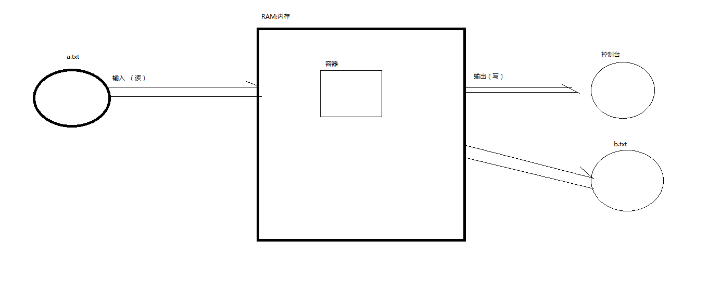
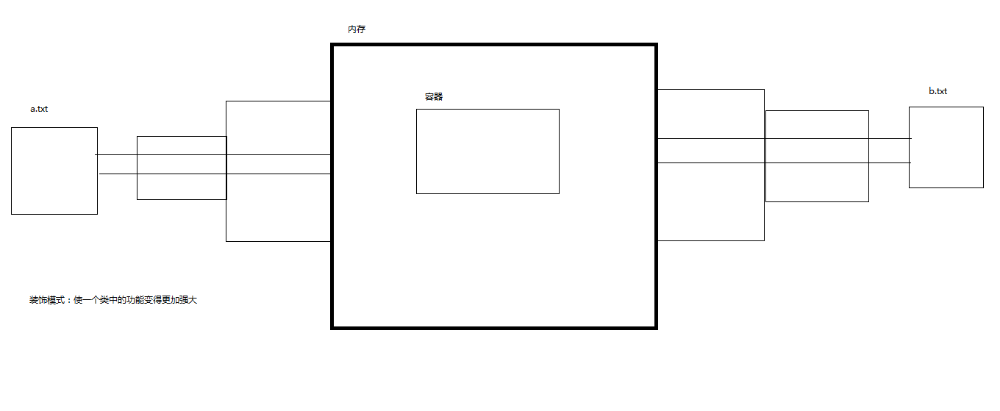
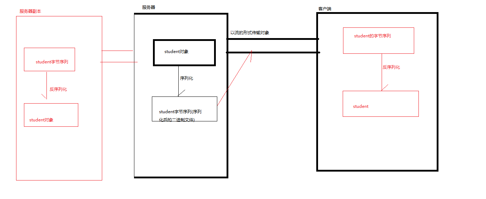
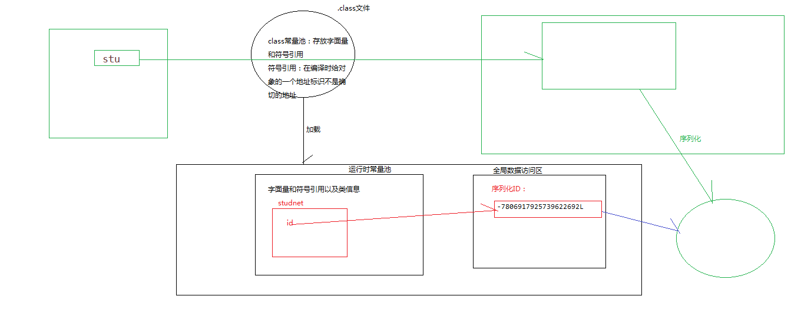

# 第十二章：文件与流

- ## File类

  - **概述：**java中对文件管理的类

    java中文件的管理，主要是针对文件或是目录路径名的管理
    文件的属性信息
    文件的检查
    文件的删除等
    不包括文件的访问

  - **File对象的创建**

    ```java
    public static void main(String[] args) {
    //		文件对象的创建
    		
    //		File(File parent, String child)创建从一个家长的抽象路径名和一个孩子的路径字符串的新 File实例。  
    		File parent=new File("D:/");
    		File source=new File(parent,"a.txt");
    		System.out.println(source);//D:\a.txt
    //		如果文件不存在那么在磁盘中创建该文件
    		if(!source.exists()) { //判断文件是否真的存在
    			try {
    				source.createNewFile();//创建空白文件
    			} catch (IOException e) {
    				e.printStackTrace();
    			}
    		}
    		parent=new File("D:/pic");
    		source=new File(parent,"b.txt");
    		if(!source.exists()) { //判断文件是否真的存在
    			try {
    				source.createNewFile();//创建空白文件
    			} catch (IOException e) {
    				e.printStackTrace();
    			}
    		}
    		
    
    //		File(String pathname) 通过将给定的路径名的字符串转换成一个抽象路径名创建一个新的 File实例。
    		source=new File("D:\\b.txt");
    		if(!source.exists()) { //判断文件是否真的存在
    			try {
    				source.createNewFile();//创建空白文件
    			} catch (IOException e) {
    				e.printStackTrace();
    			}
    		}
    //		File(String parent, String child) 
    //		创建从父路径名的字符串和一个孩子的一个新的 File实例文件。
    		source=new File("D:/","c.txt");
    		if(!source.exists()) { //判断文件是否真的存在
    			try {
    				source.createNewFile();//创建空白文件
    			} catch (IOException e) {
    				e.printStackTrace();
    			}
    		}
    //		当前工程根目录下创建文件实例a.txt
    		source=new File("a.txt");
    		if(!source.exists()) { //判断文件是否真的存在
    			try {
    				source.createNewFile();//创建空白文件
    			} catch (IOException e) {
    				e.printStackTrace();
    			}
    		}
    //		创建文件夹对象
    //		在D盘下创建image文件夹
    		source=new File("D:/image");
    		if(!source.exists()) { //判断文件是否真的存在
    			source.mkdir();//创建单级目录
    		}
    //		在D盘下创建a/b/c文件夹
    		source=new File("D:/a/b/c");
    		if(!source.exists()) { //判断文件是否真的存在
    			source.mkdirs();//创建单级或多级目录
    		}
    //		在刚刚创建的a/b/c文件夹下新建一个空白文件 x.txt
    		source=new File(source,"x.txt");
    		if(!source.exists()) { //判断文件是否真的存在
    			try {
    				source.createNewFile();//创建空白文件
    			} catch (IOException e) {
    				e.printStackTrace();
    			}
    		}
    		
    //		在当前工程根目录下创建pic文件
    		source=new File("pic");
    		if(!source.exists()) { //判断文件是否真的存在
    			source.mkdirs();//创建单级或多级目录
    		}
    	}
    
    }
    ```

    

- **File类常用的方法**

```java
/**
 * File类常用的方法
 * @author Administrator
 *
 */
public class FileMethod {

	public static void main(String[] args) {
//		boolean  createNewFile()  创建空白文件
//		boolean exists( )测试此抽象路径名表示的文件或目录是否存在
//		boolean delete( )删除此抽象路径名表示的文件或目录
		/**
		 * 注意：删除目录时只能删除空白目录
		 */
		File dest=new File("D:/a.txt");
		System.out.println(dest.delete());
		dest=new File("pic");
		dest.delete();
		File f1=new File("D:/a/b/c");
		System.out.println(f1.delete());
		f1=new File("D:/a");
		System.out.println(f1.delete());
//		返回文件或目录的绝对路径
		System.out.println(f1.getAbsolutePath());//D:\a
		File f2=new File("a.txt");
		System.out.println(f2.getAbsolutePath());//E:\eclipse-jee-photon-R-win32-x86_64\eclipse\java8\javase_day11\a.txt
//		返回文件或目录的相对路径
		System.out.println(f2.getPath());//a.txt
		System.out.println(f1.getPath());//D:\a
//		返回文件或目录名
		System.out.println(f2.getName());//a.txt
		System.out.println(f1.getName());//a
//		boolean equals(Object obj)	测试此抽象路径名与给定对象是否相等 
		File f3=new File("D:/c.txt");
		System.out.println(f1.equals(f2));//false
		System.out.println(f3.equals(new File("D:\\c.txt")));//true
		
//		String[] list() 返回由此抽象路径名所表示的目录中的文件和目录的名称所组成字符串数组 
		File f4=new File("D:");
		String[] fileList=f4.list();
		System.out.println(Arrays.toString(fileList));
		
//		long length() 返回由此抽象路径名表示的文件的大小，以byte为单位  
		System.out.println(f3.length());//注意：UTF-8编码中的文件，首行有一个空白字符用来标注该文件时UTF-8编码
	}

}
```

- ## IO流(Stream)

  - **概念**：代表的是程序中数据的流通

  - **数据**：数据就是程序中的信息

  - **数据流**：在程序中流通的数据，是一串连续不断的数据的集合

  - 在Java程序中，对于数据的输入/输出操作是以流(Stream)的方式进行的

    - 输入流 — 流入程序的数据
    - 输出流 — 流出程序的数据

  - **流的分类**

    - 按照流向来分：

      输入流(xxxInputStream,xxxReader)，输出流(xxxOutputStream,xxxWriter)

    - 按照数据处理单位来分：

      字节流(xxxInputStream，xxxOutputStream),字符流（xxxReader,xxxWriter）

    - 按照功能大小来分：节点流，处理流

    

- **字节输入流**

  ```java
  **
   * 1、在D盘下创建a.txt文件，并在里面写上内容,使用字节输入流读取文件中的内容输出到控制台
   * @author Administrator
   *
   */
  public class TestRead {
  //	1、在D盘下创建a.txt文件，并在里面写上内容,使用字节输入流读取文件中的内容输出到控制台
  //	字节输入流：一个一个字节的读取
  	public static void testByteRead() {
  //		①创建文件对象
  		File source=new File("D:/a.txt");
  		FileInputStream in=null;
  		try {
  //			②搭建输入管道
  			in=new FileInputStream(source);
  //			③通过管道读取内容进内存
  			int a=in.read();//读一次，读到一个字节
  			/*ASCIll编码  一个中文两个字节  数字和字母都是一个字节   
  			 *UTF-8编码：一个中文三个字节  数字和字母都是一个字节
  		              注意：UTF-8编码文件开头有一个空白字符标注该文件的字符集为UTF-8*/
  //			④从内存中输出读到的内容到控制台			
  			System.out.println(a);//49   1
  			a=in.read();
  			System.out.println(a);//50   2
  			a=in.read();
  			System.out.println(a);
  			a=in.read();
  			System.out.println(a);//97  a
  			a=in.read();
  			System.out.println(a);
  			a=in.read();
  			System.out.println(a);
  			a=in.read();
  			System.out.println(a); //文件中内容已经读完时返回-1  读不到内容返回-1 
    
  		} catch (Exception e) {
  			e.printStackTrace();
  		}finally {
  			try {
  				in.close();//流是非常消耗内存的，所以使用完之后要关闭
  			} catch (IOException e) {
  				e.printStackTrace();
  			}
  		}
  	}
  	
  
  	public static void main(String[] args) {
  		testByteRead();
  
  	}
  
  }
  ```

  

- **字节输出流**

  ```java
  /**
   * 将123abc写到D：/b.txt
   * @author Administrator
   *
   */
  public class TestWriter {
  	public static void testByteWriter() {
  //		创建文件对象
  		File dest=new File("D:/b.txt");
  		FileOutputStream out=null;
  		try {
  //			搭建输出管道
  			out=new FileOutputStream(dest);
  //			使用输出管道将内存中的内容输出到文件中
  //			write(int) 一个一个字节写,如果没有文件存在，这个方法会帮你在磁盘中创建文件
  			out.write(49);// 1  49  
  			out.write(50);// 
  			out.write(51);
  			out.write(97);
  			out.write(98);
  			out.write(99);// c  99
  			
  		} catch (Exception e) {
  			e.printStackTrace();
  		}finally {
  //			关闭流
  			try {
  				out.close();
  			} catch (IOException e) {
  				e.printStackTrace();
  			}
  		}
  
  
  	}
  
  	public static void main(String[] args) {
  		testByteWriter();
  
  	}
  
  }
  
  ```

  

- **字节流文件拷贝**

  ```java
  /**
   * 在D盘下创建a.txt文件，并在里面写上内容,使用字节输入流读取文件中的内容并使用字节输出流输出到D：/b.txt(文件拷贝)
   * @author Administrator
   *
   */
  public class TestStreamCopy {
  //	使用字节流完成文件拷贝
  	public static void testCopeOne() {
  //		创建文件实例
  		File source=new File("D:/a.txt");//源文件
  		File dest=new File("E:/b.txt");
  //		搭建输入输出管道
  		FileInputStream in=null;
  		FileOutputStream out=null;
  		try {
  //			通过输入输出管道完成文件的读写:读一次写一次
  			in=new FileInputStream(source);
  			out=new FileOutputStream(dest);
  			/*int a=in.read();
  			out.write(a);
  			a=in.read();
  			out.write(a);
  			a=in.read();
  			out.write(a);
  			a=in.read();
  			out.write(a);*/
  //			读多少写多少
  			int a=0;//用来保存读到的字节
  			while((a=in.read())!=-1) {
  				out.write(a);
  			}
  		} catch (Exception e) {
  			e.printStackTrace();
  		}finally {
  			try {
  //				关闭流
  				in.close();
  				out.close();
  			} catch (IOException e) {
  				e.printStackTrace();
  			}
  		}
  
  	}
  
  	public static void main(String[] args) {
  		testCopeOne();
  	}
  
  }
  
  ```

  - **开辟字节数组读写**

    ```java
    	
    //	使用字节流完成文件拷贝--字节数组
    	public static void testCopeTwo() {
    //		创建文件实例
    		File source=new File("D:/a.txt");//源文件
    		File dest=new File("D:/b.txt");
    //		搭建输入输出管道
    		FileInputStream in=null;
    		FileOutputStream out=null;
    		try {
    //			通过输入输出管道完成文件的读写:读一次写一次
    			in=new FileInputStream(source);
    			out=new FileOutputStream(dest);
    //			byte[] b=new byte[1024];//工业环境下是1024
    			byte[] b=new byte[6];
    //			将数据读到字节数组中,一次读一个数组
    	/*		int len=in.read(b);//返回读到的字节个数
    			System.out.println(len);//6
    			System.out.println(Arrays.toString(b));//[97, 98, 99, 100, 101, 102]
    			len=in.read(b);
    			System.out.println(Arrays.toString(b));//[103, 104, 105, 106, 107, 108]
    			System.out.println(len);//6
    			len=in.read(b);
    			System.out.println(len);//2
    			System.out.println(Arrays.toString(b));//[109, 110, 105, 106, 107, 108]
    			len=in.read(b);
    			System.out.println(len);//-1 读不到返回-1
    */			
    //			一边读一边写
    			int len=0;
    			while((len=in.read(b))!=-1) {
    
    //				out.write(b);
    //				读到多少就写多少
    				/**
    				 * b：源数组
    				 * off：数组的开始索引，从哪里开始
    				 * len：长度
    				 */
    				out.write(b, 0, len);
    			}
    		} catch (Exception e) {
    			e.printStackTrace();
    		}finally {
    			try {
    //				关闭流
    				in.close();
    				out.close();
    			} catch (IOException e) {
    				e.printStackTrace();
    			}
    		}
    
    	}
    ```

  - **字节流的使用场景**

    - 因为字节流处理数据的单位以字节为单位，不适合读写数据量比较大的文件比如一些文本文件
    - 一般字节流用于读写二进制文件比如：音频、视频、图片等

    ```java
    //	一般字节流用于读写二进制文件比如：音频、视频、图片等
    	public static void testCopeThree() {
    //		创建文件实例
    		File source=new File("D:/a.jpg");//源文件
    		File dest=new File("E:/feizhuliu.jpg");
    //		搭建输入输出管道
    		FileInputStream in=null;
    		FileOutputStream out=null;
    		try {
    //			通过输入输出管道完成文件的读写:读一次写一次
    			in=new FileInputStream(source);
    			out=new FileOutputStream(dest);
    			byte[] b=new byte[1024];
    //			将数据读到字节数组中,一次读一个数组
    //			一边读一边写
    			int len=0;
    			while((len=in.read(b))!=-1) {
    				out.write(b, 0, len);
    			}
    		} catch (Exception e) {
    			e.printStackTrace();
    		}finally {
    			try {
    //				关闭流
    				in.close();
    				out.close();
    			} catch (IOException e) {
    				e.printStackTrace();
    			}
    		}
    
    	}
    ```

    

- 字符流：一个一个字符的读写
  
- 使用场景：一般用于读写数据量较大的文本文件，不能读写二进制文件
  
- 使用字符流注意的问题：
  - 源文件和目标文件的字符集保持一致
  - 当开辟字符数组读写时，如果想马上刷新数组中的数据到目标文件使用flush方法

- **字符输入流**

  ```java
  //	2、在D盘下创建a.txt文件，并在里面写上内容,使用字符输入流读取文件中的内容输出到控制台
  //	注意使用字符流进行读写时，要保证字符集编码格式一致
  	public static void testCharRead() {
  		File source=new File("D:/a.txt");
  		FileReader in=null;
  		try {
  			in=new FileReader(source);
  			int a=in.read();//一个一个字符读
  			System.out.println((char)a);
  			a=in.read();
  			System.out.println((char)a);
  			a=in.read();
  			System.out.println((char)a);
  			a=in.read();
  			System.out.println((char)a);
  			a=in.read();
  			System.out.println((char)a);
  			a=in.read();
  			System.out.println(a);//20013 中
  			a=in.read();
  			System.out.println(a);//22269 国
  			a=in.read();
  			System.out.println(a);//-1 找不到返回-1
  
  		} catch (Exception e) {
  			// TODO Auto-generated catch block
  			e.printStackTrace();
  		}finally {
  			try {
  				in.close();
  			} catch (IOException e) {
  				e.printStackTrace();
  			}
  		}
  		
  	}
  ```

- **字符输出流**

  ```java
  //	使用字符流将123abc中写到D：/b.txt
  	public static void testCharWriter() {
  		File dest=new File("D:/b.txt");
  		FileWriter out=null;
  		try {
  //			搭建字符输出管道
  			out=new FileWriter(dest);
  			out.write(49);//一个一个字符的写
  			out.write(50);
  			out.write(51);
  			out.write(97);
  			out.write(98);
  			out.write(99);
  			out.write(20013);//中
  			out.write(22269);//国
  			
  		} catch (IOException e) {
  			e.printStackTrace();
  		}finally {
  //			关闭流
  			try {
  				out.close();
  			} catch (IOException e) {
  				// TODO Auto-generated catch block
  				e.printStackTrace();
  			}
  		}
  	}
  
  ```

  - **使用字符流完成文件拷贝**

    ```java
    //	使用字符流完成文件拷贝
    	public static void testCopyOne() {
    //		创建文件实例
    		File source=new File("D:/a.txt");//源文件
    		File dest=new File("E:/b.txt");
    //		搭建输入输出管道
    		FileReader in=null;
    		FileWriter out=null;
    		try {
    			in=new FileReader(source);
    			out=new FileWriter(dest);
    			int a=0;//用来接收读到的字符数据
    			while((a=in.read())!=-1) {
    				out.write(a);
    			}
    		} catch (Exception e) {
    			// TODO Auto-generated catch block
    			e.printStackTrace();
    		}finally {
    			try {
    				in.close();
    				out.close();
    			} catch (IOException e) {
    				// TODO Auto-generated catch block
    				e.printStackTrace();
    			}
    		}
    	}
    //	字符流使用场景：一般用于读写数据量较大的文本文件，不能读写二进制文件会导致文件损坏
    	
    	public static void testCopyTwo() {
    //		创建文件实例
    		File source=new File("D:/a.jpg");//源文件
    		File dest=new File("E:/b.jpg");
    //		搭建输入输出管道
    		FileReader in=null;
    		FileWriter out=null;
    		try {
    			in=new FileReader(source);
    			out=new FileWriter(dest);
    			int a=0;//用来接收读到的字符数据
    			while((a=in.read())!=-1) {
    				out.write(a);
    			}
    		} catch (Exception e) {
    			// TODO Auto-generated catch block
    			e.printStackTrace();
    		}finally {
    			try {
    				in.close();
    				out.close();
    			} catch (IOException e) {
    				// TODO Auto-generated catch block
    				e.printStackTrace();
    			}
    		}
    	}
    //	开辟字符数组进行读写
    	public static void testCopyThree() {
    //		创建文件实例
    		File source=new File("D:/a.txt");//源文件
    		File dest=new File("D:/b.txt");
    //		搭建输入输出管道
    		FileReader in=null;
    		FileWriter out=null;
    		try {
    			in=new FileReader(source);
    			out=new FileWriter(dest);
    //			创建字符数组用于接收读取的字符数据
    //			char[] c=new char[1024] 工业环境下
    			char[] c=new char[6];
    //			int len=in.read(c);//返回读到的字符个数
    //			String mess="我爱你中国";
    //			out.write(mess.toCharArray());
    			int len=0;
    			while((len=in.read(c))!=-1) {
    //				读多少写多少
    				out.write(c, 0, len);
    //				什么时候使用flush:如果不想内存紧张可以马上flush或者想马上输出数据可以flush
    				out.flush();//刷新数组中的数据，将数组中的数据马上输出
    			}
    //			out.flush();
    //			System.out.println(Arrays.toString(c));
    		} catch (Exception e) {
    			// TODO Auto-generated catch block
    			e.printStackTrace();
    		}finally {
    			try {
    				in.close();
    				out.close();//会默认调用flush方法刷新数组中的数据，这样的操作避免程序由于忘记flush二出现数据不输出的问题
    			} catch (IOException e) {
    				// TODO Auto-generated catch block
    				e.printStackTrace();
    			}
    		}
    	}
    ```

    

- **处理流和节点流**

  

  - 节点流：直接操作文件的流,和源文件及目标文件直接接触
  - 处理流：操作流的流，和流直接接触
    - 连接”在已存在的流（节点流或处理流）之上，通过对数据的处理为程序提供更为强大的读写功能
      处理流类的构造函数中，都必须接收另外一个流对象作为参数

- **处理流：**

```java
/**
 * 使用处理流让字节流变字符流
 * @author Administrator
 *
 */
public class TestDisposeStream {
	public static void testOne() {
		File source=new File("D:/a.txt");
		File dest=new File("D:/b.txt");
//		使用字节流读写
//		搭建输入输出管道
		FileInputStream in=null;
		FileOutputStream out=null;
//		处理流：使字节流变字符流
		InputStreamReader in_r=null;
		OutputStreamWriter out_w=null;
		try {
//			通过输入输出管道完成文件的读写:读一次写一次
			in=new FileInputStream(source);
			out=new FileOutputStream(dest);
			in_r=new InputStreamReader(in);
			out_w=new OutputStreamWriter(out);
			int a=0;
			while((a=in_r.read())!=-1) {
				out_w.write(a);
			}
		} catch (Exception e) {
			e.printStackTrace();
		}finally {
			try {
//				关闭流:先关闭处理流在关闭节点流
				in_r.close();
				out_w.close();
				in.close();
				out.close();
				
			} catch (IOException e) {
				e.printStackTrace();
			}
		}
	}
	public static void main(String[] args) {
		testOne();
	}

```

- **缓冲流**

```java
public class TestBufferStream {
//	开辟缓冲区读写
	public static void testBufferStream() {
		File source=new File("D:/a.txt");//源文件
		File dest=new File("D:/b.txt");
//		搭建缓冲流管道  
		BufferedReader bf=null;
		BufferedWriter bw=null;
		try {
			bf=new BufferedReader(new FileReader(source));
			bw=new BufferedWriter(new FileWriter(dest));
//			一行一行进行读写
//			String message=bf.readLine();//读一行  如果读不到数据返回null
			String message=null;
			while((message=bf.readLine())!=null) {
				bw.write(message);
				bw.newLine();//相当于敲回车  换行
				bw.flush();
			}
			
		} catch (Exception e) {
			// TODO Auto-generated catch block
			e.printStackTrace();
		}finally {
			try {
				bf.close();
				bw.close();
			} catch (IOException e) {
				// TODO Auto-generated catch block
				e.printStackTrace();
			}
		}
	}

	public static void main(String[] args) {
		testBufferStream();


	}
```

- **序列化与反序列化**

  - **序列化**：是指将对象转换为字节序列的过程

    - 永久性保存对象，保存对象的字节序列到本地文件中

    - 过序列化对象在网络中传递对象--安全性，提高传输速度

    - 通过序列化在进程间传递对象

    - 通过序列化在进程间传递对象

      

      - 能被序列化的对象所属的类必须实现序列化接口(Serializable接口)

  - **反序列化**：是根据字节序列恢复对象的过程

    - 对象必须序列化之后才能反序列化

    ```java
    
    public class TestSerialization {
    
    	public static void main(String[] args) {
    //		序列化：通过ObjectOutputStream将对象转为字节序列的过程
    		Student stu=new Student();
    		stu.name="zhangsan";
    		stu.password="123456";
    		Student.address="东软";
    		
    		System.out.println(stu);//Student [name=zhangsan, age=0, address=东软, password=123456]
    
    //		将stu对象序列化后存储在D:/student.txt
    		ObjectOutputStream out=null;
    		try {
    			out=new ObjectOutputStream(new FileOutputStream(new File("D:/student.txt")));
    			out.writeObject(stu);
    		} catch (Exception e) {
    			e.printStackTrace();
    		}finally {
    			try {
    				out.close();
    			} catch (IOException e) {
    				e.printStackTrace();
    			}
    		} 
    //		反序列化：将序列化后的对象字节序列转为原本对象的过程-ObjectInputStream
    		ObjectInputStream in=null;
    		try {
    			in=new ObjectInputStream(new FileInputStream(new File("D:/student.txt")));
    			Student ss=(Student) in.readObject();
    			System.out.println(ss);
    		} catch (Exception e) {
    			// TODO Auto-generated catch block
    			e.printStackTrace();
    		}
    	}
    
    }
    ```

    

  - **transient关键字**：修饰属性

    transient修饰的属性不进行序列化的操作，起到一定消息屏蔽的效果
    被transient修饰的属性可以正确的创建，但被系统赋为默认值。即int类型为0，String类型为null

  - **序列化的优点：**

     ①将对象转为字节流存储到硬盘上，当JVM停机的话，字节流还会在硬盘上默默等待，等待下一次JVM的启动，把序列化的对象，通过反序列化为原来的对象，并且序列化的二进制序列能够减少存储空间（永久性保存对象）。

     ②序列化成字节流形式的对象可以进行网络传输(二进制形式)，方便了网络传输。

     ③通过序列化可以在进程间传递对象。

  - 序列化ID：类在内存的唯一标识

    **作用：**

    ​    其实，这个序列化ID起着关键的作用，它决定着是否能够成功反序列化！简单来说，java的序列化机制是通过在运行时判断类的serialVersionUID来验证版本一致性的。在进行反序列化时，JVM会把传来的字节流中的serialVersionUID与本地实体类中的serialVersionUID进行比较，如果相同则认为是一致的，便可以进行反序列化，否则就会报序列化版本不一致的异常。等会我们可以通过代码验证一下。
    
    