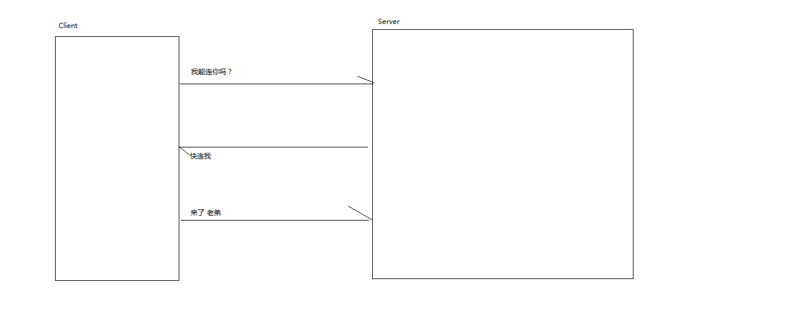
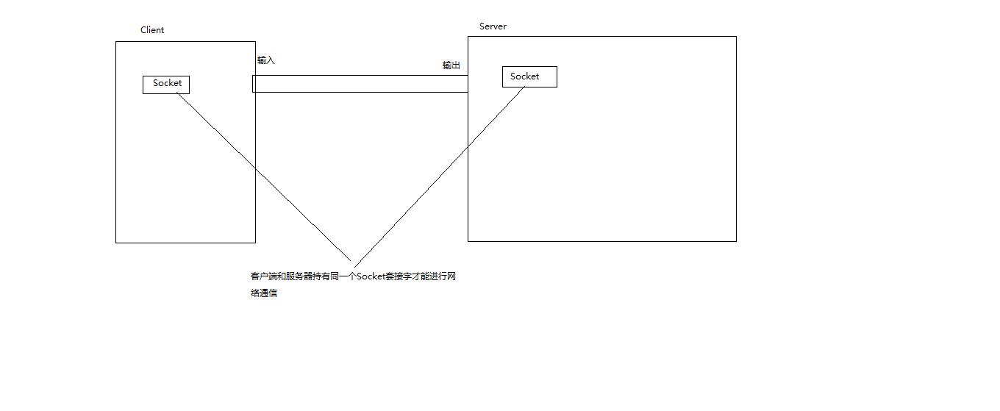
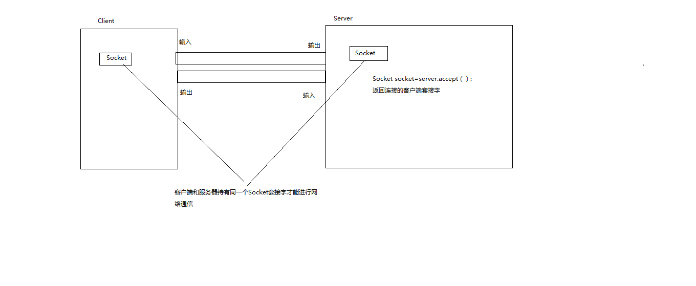
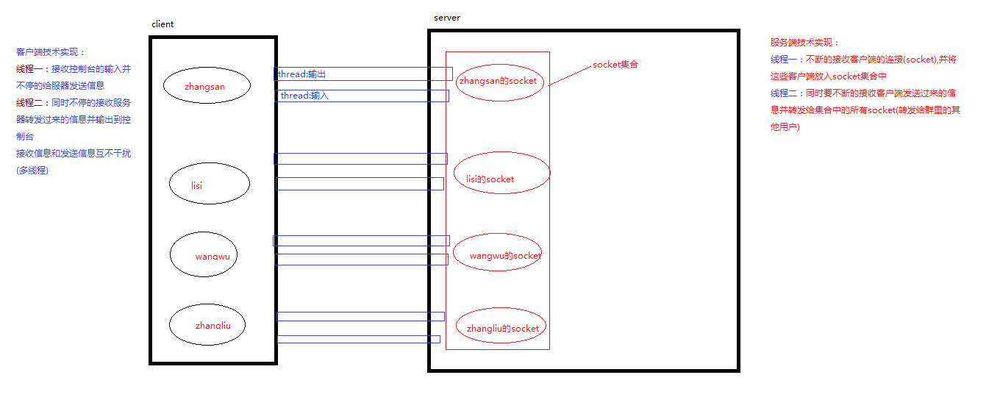

# 第十四章：网络编程

- **概述**：通过使用套接字(Socket)来达到进程间通信目的编程就是网络编程 

- **网络通信三要素**：

  - IP地址:电子设备(计算机)在网络中的唯一标识

  - 端口号（0~65535）：应用程序(进程)在计算机中的唯一标识，0~1023用于一些知名的网络服务和应用，用户的普通网络程序应使用1024以上的端口号

  - 通信协议：规定客户端和服务器之间通信时数据传输的格式

    - TCP/IP:安全的传输协议，安全但较慢，三次握手

      

    - UDP协议：广播协议，传输速度较快但不安全,例如报刊订阅..

- **Socket原理**
      Socket—套接字
      是网络应用程序编程的接口和一种机制
       用套接字中的相关函数来建立连接和完成通信
       Socket可以看成在两个程序进行通讯连接中的一个端点
      将区分不同应用程序进程的三个参数
      通信的目的的IP地址
      使用的传输层协议
      使用的端口号
       与一个socket绑定

  ​	

- **网络编程1_测试客户端与服务器连接**

  ```java
  Clinet:
  //		创建一个客户端套接字 
  		/**
  		 * Socket(InetAddress address, int port) 
  			创建一个流套接字，并将其与指定的IP地址中的指定端口号连接起来。
  		 */
  		Socket client=null;
  		try {
  //			client=new Socket("10.25.164.155",45678);
  //			127.0.0.1/localhost本地IP
  			client=new Socket("localhost",45678);
  		} catch (Exception e) {
  
  			e.printStackTrace();
  		}
  	}
  ```

  

```java
Server:
//		服务器:ServerSocket(int port),创建一个服务器套接字，绑定到指定的端口。
		ServerSocket server=null;
		try {
			server=new ServerSocket(45678);
			server.accept();//这个方法会阻塞,等待客户端的连接，一旦有客户端连接那么阻塞解除
			System.out.println("有客户端连接过来了");
		} catch (IOException e) {
			e.printStackTrace();
		}
		
		
	}
```

- **网络编程2_客户端服给务器发送消息(通过流的形式--字节流)**

  ```java
  Client:
  //		创建一个客户端套接字 
  		/**
  		 * Socket(InetAddress address, int port) 
  			创建一个流套接字，并将其与指定的IP地址中的指定端口号连接起来。
  		 */
  		Socket client=null;
  		OutputStream out=null;
  		try {
  //			client=new Socket("10.25.164.155",45678);
  //			127.0.0.1/localhost本地IP
  			client=new Socket("localhost",45678);
  //			通过socket获取字节流对象
  			out=client.getOutputStream();
  //			InputStream in=client.getInputStream();
  //			客户端给服务器发送一句话：你好，服务器；今天真的好冷
  			String message="client:你好，服务器；今天真的好冷";
  			out.write(message.getBytes());
  		} catch (Exception e) {
  			e.printStackTrace();
  		}finally {
  //			out.close();  如果在这个客户端处理异常代码繁琐
  			DealException.closeResouce(out,null);
  		}
  	}
  ```

  ```java
  Server:
  	//		服务器:ServerSocket(int port),创建一个服务器套接字，绑定到指定的端口。
  		ServerSocket server=null;
  		Socket socket=null;
  		InputStream in=null;
  		try {
  			server=new ServerSocket(45678);
  //			返回客户端套接字：保证了客户端和服务器操作用一个套接字流对象
  			socket=server.accept();//这个方法会阻塞,等待客户端的连接，一旦有客户端连接那么阻塞解除
  			System.out.println("有客户端连接过来了");
  			in=socket.getInputStream();
  //			服务器读取客户端发送过来的消息
  			byte[] b=new byte[1024];
  			in.read(b);
  //			将读到的信息输出到控制台
  			System.out.println(new String(b));
  		} catch (IOException e) {
  			e.printStackTrace();
  		}finally {
  			DealException.closeResouce(null,in);
  		}
  		
  		
  	}
  ```

  ```java
  //	关闭字节流资源
  	public static void  closeResouce(OutputStream out,InputStream in) {
  //		非空判断
  		if(out!=null) {
  			try {
  				out.close();
  			} catch (IOException e) {
  				// TODO Auto-generated catch block
  				e.printStackTrace();
  			}
  		}
  		if(in!=null) {
  			try {
  				in.close();
  			} catch (IOException e) {
  				// TODO Auto-generated catch block
  				e.printStackTrace();
  			}
  		}
  		
  	}
  ```

  

- **网络编程3：客户端和服务器进行一次会话**

  ```java
  client：
  	//		创建一个客户端套接字 
  		/**
  		 * Socket(InetAddress address, int port) 
  			创建一个流套接字，并将其与指定的IP地址中的指定端口号连接起来。
  		 */
  		Socket client=null;
  		OutputStream out=null;
  		InputStream in=null;
  		try {
  //			client=new Socket("10.25.164.155",45678);
  //			127.0.0.1/localhost本地IP
  			client=new Socket("localhost",45678);
  //			通过socket获取字节流对象
  			out=client.getOutputStream();
  			in=client.getInputStream();
  //			客户端给服务器发送一句话：你好，服务器；今天真的好冷
  			String message="client:你好，服务器；今天真的好冷";
  			out.write(message.getBytes());
  			
  //			客户端接收服务器发送过来的信息
  			byte[] b=new byte[1024];
  			in.read(b);//这个方法会阻塞，等待服务器发送过来的信息
  			System.out.println(new String(b));
  			
  		} catch (Exception e) {
  			e.printStackTrace();
  		}finally {
  //			out.close();  如果在这个客户端处理异常代码繁琐
  			DealException.closeResouce(out,in);
  		}
  	}
  
  ```

  ```java
  server:
  	//		服务器:ServerSocket(int port),创建一个服务器套接字，绑定到指定的端口。
  		ServerSocket server=null;
  		Socket socket=null;
  		InputStream in=null;
  		OutputStream out=null;
  		try {
  			server=new ServerSocket(45678);
  //			返回客户端套接字：保证了客户端和服务器操作用一个套接字流对象
  			socket=server.accept();//这个方法会阻塞,等待客户端的连接，一旦有客户端连接那么阻塞解除
  			System.out.println("有客户端连接过来了");
  			in=socket.getInputStream();
  //			服务器读取客户端发送过来的消息
  			byte[] b=new byte[1024];
  			in.read(b);//这个方法会阻塞，等待客户端发送过来的信息
  //			将读到的信息输出到控制台
  			System.out.println(new String(b));
  //			服务器给客户端发送一条信息
  			out=socket.getOutputStream();
  			String message="server:是啊  今天真的好冷";
  			out.write(message.getBytes());
  		} catch (IOException e) {
  			e.printStackTrace();
  		}finally {
  			DealException.closeResouce(out,in);
  		}
  	}
  
  ```

- **网络编程4：try-with语句块**：自动释放流资源

  - 语法：try(流对象){语句块}catch(异常对象){处理异常}，注意如果有多个流对象需要使用时用";"隔开即可

  ```java
  client:
  		Socket client=null;
  		try {
  			client=new Socket("localhost",45678);
  		} catch (Exception e) {
  			e.printStackTrace();
  		} 
  		/**
  		 * try(流对象){语句块}catch(异常对象){处理异常}，注意如果有多个流对象需要使用时用";"隔开即可
  		 */
  
  		try(OutputStream out=client.getOutputStream();
  				InputStream in=client.getInputStream()){
  //			先写后读
  //			接收控制台输入的信息并发送给服务器
  			Scanner sc=new Scanner(System.in);
  //			使用死循环完成一直chat
  			while(true) {
  			String message="client:"+sc.nextLine();//这个方法会阻塞，等待控制台的输入
  			out.write(message.getBytes());
  			
  //			读取从服务器发送过来的信息
  			byte[] b=new byte[1024];
  			in.read(b);//这个方法会阻塞，等待服务器发送过来的信息
  			System.out.println(new String(b));
  			}
  		}catch (Exception e) {
  			e.printStackTrace();
  		}
  		
  		
  ```

  

  ```java
  server:
  	//		创建服务器
  		ServerSocket server=null;
  		Socket socket=null;
  		try {
  			server=new ServerSocket(45678);
  			socket=server.accept();//返回客户端套接字
  		} catch (IOException e) {
  			e.printStackTrace();
  		}
  
  		try(OutputStream out=socket.getOutputStream();
  				InputStream in=socket.getInputStream()){
  			Scanner sc=new Scanner(System.in);
  //			使用死循环完成一直chat
  			while(true) {
  //			先读后写
  //			读取从客户端发送过来的信息
  			byte[] b=new byte[1024];
  			in.read(b);//这个方法会阻塞，等待客户端发送过来的信息
  			System.out.println(new String(b));
  //			接收控制台输入的信息并发送给客户端
  			
  			String message="server:"+sc.nextLine();//这个方法会阻塞，等待控制台的输入
  			out.write(message.getBytes());	
  			}
  		}catch (Exception e) {
  			e.printStackTrace();
  		}
  		
  	}
  
  ```

  

- **网络编程5：使用缓冲流进行聊天**

  ```java
  client:	
  	Socket client=null;
  		try {
  			client=new Socket("localhost",45678);
  		} catch (Exception e) {
  			e.printStackTrace();
  		} 
  		/**
  		 * try(流对象){语句块}catch(异常对象){处理异常}，注意如果有多个流对象需要使用时用";"隔开即可
  		 */
  
  		try(BufferedReader in=new BufferedReader(new InputStreamReader(client.getInputStream()));
  				PrintWriter pw=new PrintWriter(new OutputStreamWriter(client.getOutputStream()),true)//true :表示刷新缓冲区
  				){
  //			先写后读
  //			接收控制台输入的信息并发送给服务器
  			Scanner sc=new Scanner(System.in);
  //			使用死循环完成一直chat
  			while(true) {
  			String message="client:"+sc.nextLine();//这个方法会阻塞，等待控制台的输入
  			pw.println(message);
  			
  //			读取从服务器发送过来的信息
  			String result=in.readLine();//这个方法会阻塞，等待服务器发送过来的信息
  			System.out.println(result);
  			}
  		}catch (Exception e) {
  			e.printStackTrace();
  		}
  ```

  

```java
server:
	//		创建服务器
		ServerSocket server=null;
		Socket socket=null;
		try {
			server=new ServerSocket(45678);
			socket=server.accept();//返回客户端套接字
		} catch (IOException e) {
			e.printStackTrace();
		}

		try(BufferedReader in=new BufferedReader(new InputStreamReader(socket.getInputStream()));
				PrintWriter pw=new PrintWriter(new OutputStreamWriter(socket.getOutputStream()),true)//true :表示刷新缓冲区
				){
//			先读后写
//			接收控制台输入的信息并发送给服务器
			Scanner sc=new Scanner(System.in);
//			使用死循环完成一直chat
			while(true) {
//			读取从客户端发送过来的信息
			String result=in.readLine();//这个方法会阻塞，等待客户端发送过来的信息
			System.out.println(result);			
			
			String message="client:"+sc.nextLine();//这个方法会阻塞，等待控制台的输入
			pw.println(message);
			
			}
		}catch (Exception e) {
			e.printStackTrace();
		}
```

- **网络编程6：群聊技术实现**

  

- **群聊代码实现**--参考笔记总和

