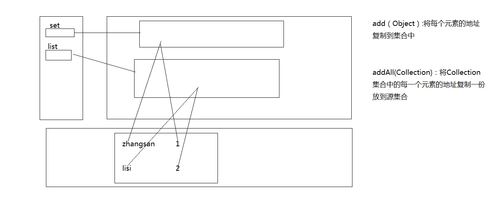
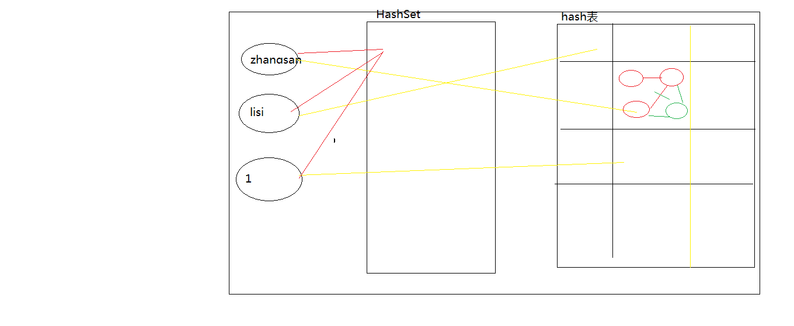
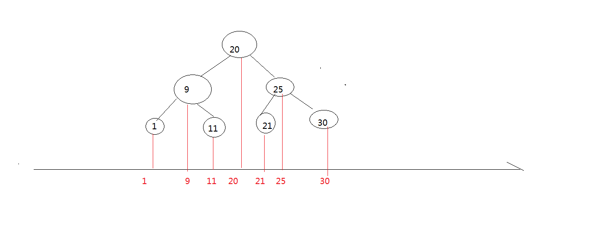
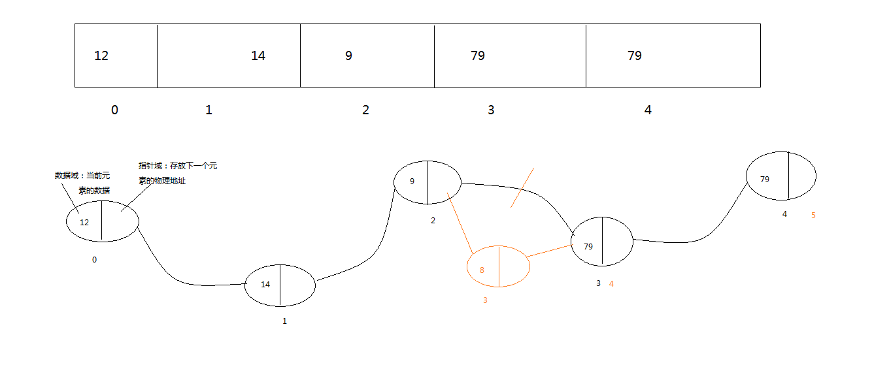
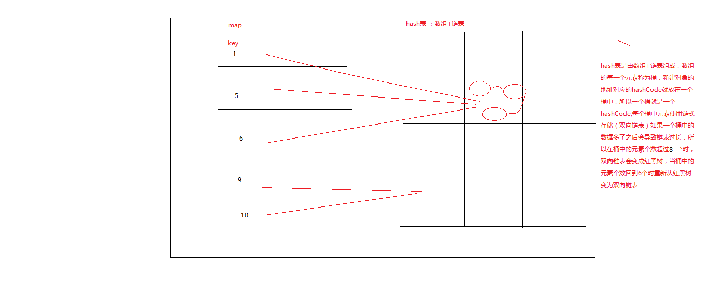

# 第十章：集合

- **集合的概述：**

  - Java中集合类是用来存放对象的，集合中只能存放引用数据类型的数据
  - 集合相当于一个容器，里面包容着一组对象--容器类
  - 其中的每个对象作为集合的一个元素出现
  - Java API提供的集合类位于java.util包内

- **集合和数组的区别：**

  - 数组也是容器，它是定长的，访问较快，但是数组不会自动扩充
  - 集合也是容器，不定长，数组可以包含基本数据类型或引用类型的对象，而集合中只能包含引用类型的对象

- **集合的继承树**

  - **单列集合（Collection）--接口**

    - **Collection中的方法：**

      ```java
      /**
       * Collection中的方法:List和Set集合都有的方法
       * @author Administrator
       *
       */
      public class TestCollection {
      	public static void main(String[] args) {
      		Student s=new Student();
      //		boolean add(Object)	集合中加入一个对象，成功时返回true
      		Set set=new HashSet<>();
      		System.out.println(set.toString());//[]
      		set.add(1);
      		set.add("zhangsan");
      		set.add('z');
      		set.add(s);
      		System.out.println(set);//[1, zhangsan, z]
      		
      		List list=new ArrayList<>();
      		list.add("lisi");
      		list.add(45);
      		list.add(129);
      		System.out.println(list);//[lisi, 45]
      		
      //		boolean addAll(Collection)	集合中加入另外一个集合对象
      		set.addAll(list);
      		System.out.println(set);//[1, lisi, 129, zhangsan, z, 45]
      //		int size()	集合内容纳的元素数量
      		System.out.println(set.size());//6
      //		boolean isEmpty()	集合是否为空
      		if(list.isEmpty()) {
      			System.out.println("可以往list集合中存放数据");
      		}else {
      			List list1=new ArrayList<>();
      			System.out.println(list1.isEmpty());//true
      			System.out.println("往新的集合中存放数据");
      		}
      //		boolean contains(Object)	集合内是否含有参数对象
      		System.out.println(set.contains("lisi"));//true
      		System.out.println(set.contains(new Student()));//false
      		
      //		Iterator iterator()	产生一个迭代器
      //		Object[] toArray()	返回一个包含所有元素的对象数组  将集合转为数组
      		Object[] o=set.toArray();
      		System.out.println(Arrays.toString(o));
      		
      //		boolean remove(Object)	从集合中删除对象
      		set.remove(s);
      		System.out.println(set);//[1, lisi, 129, zhangsan, z, 45]
      //		boolean removeAll(Collection)	清空指定集合  将源集合中包含指定集合的元素全部清除
      //		set.removeAll(list);
      		System.out.println(set);//[1, zhangsan, z]
      		List list2=new ArrayList<>();
      		list2.add(1);
      		set.removeAll(list2);
      		System.out.println(set);//[zhangsan, z]
      //		boolean containsAll(Collection)	判断集合内是否包含子集
      		System.out.println(set.containsAll(list));//true
      		System.out.println(set.containsAll(list2));//false
      
      //		boolean retainAll(Collection)	仅保留此 collection 中那些也包含在指定 collection 的元素
      		set.retainAll(list);
      		System.out.println(set);//[lisi, 129, 45]
      //		void clear()	清空集合
      		set.clear();
      		System.out.println(set);
      		
      	}
      
      }
      
      
      ```

      ```
      		Set s1=new HashSet<>();
      		s1.add(1);
      		s1.add("zhangsan");
      		System.out.println(s1);
      		
      		List list3=new ArrayList<>();
      		list3.add("lisi");
      		list3.add(2);
      		
      		System.out.println(list3);
      //		s1.addAll(list3);
      //		System.out.println(s1);
      		s1.add(list3);
      		System.out.println(s1);//[1, [lisi, 2], zhangsan]
      		
      //		set.removeAll(o)
      		
      ```

      

    - **Set集合--接口**

      ①HashSet--类

      

      ②TreeSet--类

      

      ```java
      /**
       * Set集合:
       * 		特点：三无产品  无序、无索引、无重复值
       * 			①set集合是无序的、无索引
       * 			②无重复值
       * 			③可以有null值，但只能有一个null值
       * 			
       * @author Administrator
       *	HashSet:基于散列表(hash表)--数组+链表
       *	TreeSet:基于红黑树
       *			①无重复值
       *			②默认升序排序,无索引
       *			③不能有null值
       *		
       */
      public class TestSet {
      
      	public static void main(String[] args) {
      		Set set=new HashSet<>();
      		set.add("zhangsan");
      		set.add("lisi");
      		set.add(1);
      		System.out.println(set);//[lisi, 1, zhangsan]
      		set.add("zhangsan");
      		System.out.println(set);//[lisi, 1, zhangsan]
      		set.add(null);
      		System.out.println(set);//[null, lisi, 1, zhangsan]
      		set.add(null);
      		System.out.println(set);//[null, lisi, 1, zhangsan]
      		
      		Set set1=new TreeSet<>();
      		set1.add("zhangsan");
      		set1.add("zhangsan");
      		System.out.println(set1);//[zhangsan]
      		set1.add("lisi");
      		set1.add("abc");
      		System.out.println(set1);//[abc, lisi, zhangsan]
      		
      		Set set2=new TreeSet<>();
      		set2.add(20);
      		set2.add(9);
      		set2.add(11);
      		set2.add(1);
      		set2.add(25);
      		set2.add(30);
      		set2.add(21);
      		System.out.println(set2);//[1, 9, 11, 20, 21, 25, 30]
      
      //		因为集合什么类型的对象都能放，为了方便数据的分类管理存储到集合中，一般指定集合中存放数据的类型
      		Set<String> set3=new HashSet<>();
      		set3.add("zhangsan");
      //		set3.add(12); 编译不通过
      		Set<Double> set4=new HashSet<>();
      		set4.add(90.0);
      		set4.add(90.9);
      	}
      
      }
      ```

      - **Set集合的遍历**

        ```java
        //		遍历set集合
        //		方式一：forEach
        //		for(Object o:set1) {
        //			System.out.println(o);
        //		}
        		
        //		方式二：Iterator iterator() 产生一个迭代器
        		Iterator it=set2.iterator();
        		while(it.hasNext()) {//hasNext() 判断迭代器是否有下一个值，如果有值，获取值
        			System.out.println(it.next());//it.next() 返回指针的下一个值
        		};
        
        	}
        
        ```

        

    - **List集合--接口**

      - **List集合中的方法**

        ```java
        /**
         * List集合：
         * 		 特点：三有产品     有序有索引有重复值
         * 			①有序有索引,索引从0开始，最大到size-1
         * 			②可以有重复值
         * 			③有null值,而且可以有多个
         * 
         * @author Administrator
         *	ArrayList:基于数组--不定长、在物理地址上连续的两个元素，逻辑地址也连续
         *	LinkedList:
         */
        public class TestList {
        	public static void testArrayList() {
        		List<Integer> list1=new ArrayList<>();
        		list1.add(12);
        		list1.add(14);
        		list1.add(9);
        		list1.add(79);
        		list1.add(79);
        		list1.add(null);
        		list1.add(null);
        		System.out.println("list1:"+list1);//list1:[12, 14, 9, 79, 79, null, null]
        		
        //		List集合中自有的方法  
        //		void add(int index,Object element)	在列表中的index位置，添加element元素
        		System.out.println(list1.size());//7
        		list1.add(1,99);
        		System.out.println("list1:"+list1);//list1:[12, 99, 14, 9, 79, 79, null, null]
        		
        //		Object get(int index)	返回列表中指定位置的元素 
        		System.out.println(list1.get(3));//9
        //		System.out.println(list1.get(9));, 索引越界异常
        		
        //		int indexOf(Object o)	在list中查询元素第一次出现的索引值，如不存在，返回－1。查询元素对应的下标
        		System.out.println(list1.indexOf(9));//3
        		System.out.println(list1.indexOf(0));//-1
        		list1.add(9);
        		System.out.println(list1);//[12, 99, 14, 9, 79, 79, null, null, 9]
        		System.out.println(list1.indexOf(9));//3
        		/**
        		 * List中如果存在多个重复元素，indexOf()方法返回第一个匹配元素的index。
        		 * lastIndexOf(o)是返回最后一个匹配元素的index.
        		 */
        //		int lastIndexOf(Object o)	
        		System.out.println(list1.lastIndexOf(9));//8
        //		ListIterator listIterator()	返回列表中元素的列表迭代器 
        		
        //		Object remove(int index)	移除列表中指定位置的元素 ,并且返回移除的元素
        		System.out.println(list1.remove(1));
        		System.out.println(list1);//[12, 14, 9, 79, 79, null, null, 9]
        		list1.add(5,2);
        		System.out.println(list1);//[12, 14, 9, 79, 79, 2, null, null, 9]
        		list1.remove(2);
        		System.out.println(list1);//[12, 14, 79, 79, 2, null, null, 9]
        
        		
        //		Object set(int index,Object element)	用指定元素替换列表中指定位置的元素 
        		list1.set(3, 89);
        		System.out.println(list1);//[12, 14, 79, 89, 2, null, null, 9]
        		
        		
        	}
        	
        	public static void testLinkedList() {
        		
        	}
        	public static void main(String[] args) {
        		testArrayList();
        	}
        
        }
        ```

        

      ①ArrayList-类

      ②LinkedList--类

      

      ```java
      public static void testArrayList() {
      		List<Integer> list1=new ArrayList<>();
      		list1.add(12);
      		list1.add(14);
      		list1.add(9);
      		list1.add(79);
      		list1.add(79);
      		list1.add(0, 8);
      		System.out.println(list1);//[8, 12, 14, 9, 79, 79]
      
      	}
      	
      	public static void testLinkedList() {
      		LinkedList<Integer> list1=new LinkedList<>();
      		list1.add(12);
      		list1.add(14);
      		list1.add(9);
      		list1.add(79);
      		list1.add(79);
      		System.out.println(list1);
      		System.out.println(list1.get(3));
      		list1.add(3,8);
      		System.out.println(list1);//[12, 14, 9, 8, 79, 79]
      		
      //		void addFirst(Object o) 	将给定元素插入此列表的开头 
      		list1.addFirst(9);
      		System.out.println(list1);//[9, 12, 14, 9, 8, 79, 79]
      //		void addLast(Object o) 	将给定元素追加到此列表的结尾 
      		
      //		Object getFirst()	返回此列表的第一个元素 
      		System.out.println(list1.getFirst());//9
      //		Object getLast()	返回此列表的最后一个元素 
      		System.out.println(list1.getLast());
      		
      //		Object removeFirst()	移除并返回此列表的第一个元素 
      		System.out.println(list1.removeFirst());//9
      		System.out.println(list1);//[12, 14, 9, 8, 79, 79]
      
      //		Object removeLast()	移除并返回此列表的最后一个元素 
      		System.out.println(list1.removeLast());//79
      		System.out.println(list1);//[12, 14, 9, 8, 79]
      
      	}
      
      ```

      - **List集合的遍历**

        ```java
        //		List集合的遍历
        //		方式一：for
        //		for(int i=0;i<list1.size();i++) {
        //			System.out.println(list1.get(i));
        //		}
        //		方式二：forEach
        //		for(Integer i:list1) {
        //			System.out.println(i);
        //		}
        //		方式三：迭代器
        		Iterator it= list1.iterator();
        		while(it.hasNext()) {
        			System.out.println(it.next());
        		}
        		
        		
        ```

        - **单列集合的转换**

          ```java
          //		set转List
          		HashSet<Integer> set=new HashSet<>();
          		set.add(12);
          		set.add(9);
          		System.out.println(set);
          		
          		ArrayList<Integer> list=new ArrayList<>(set);
          		System.out.println(list);
          		
          //		List转Set
          		ArrayList<Integer> list1=new ArrayList<>();
          		list1.add(12);
          		list1.add(12);
          		list1.add(12);
          		list1.add(11);
          		
          		HashSet<Integer> set1=new HashSet<>(list1);
          		System.out.println(set1);//[11, 12]
          		
          		
          ```

          

    - **Set集合与List集合的区别**

      List是有序集合，而Set是无序集合。 List会保留元素插入时的顺序，也就是说之前插入的元素的索引要比之后插入的元素的索引要小。 而Set不会保留插入时的顺序。

  - **双列集合(Map)--接口**

    

    - HashMap--类

      ```java
  /**
       * HashMap:基于散列表,key+value存储数据，可以把一组对象当成一个元素
     * 		   通过key获取value
       * 
       *     特点：
       *     		双列存储，通过key获取value
       *     		key不能重复
       *     		key可以有null值，但只能有一个
       *     		HashMap是无序的
       *     		value可以有重复值，可以有多个null
       * @author Administrator
       *
       */
      public class TestMap {
      
      	public static void main(String[] args) {
      		Map<Integer,Object> map=new HashMap<>();
      //		给map集合调加元素
      		map.put(1, "zhangsan");
      		map.put(5, "lisi");
      		
      //		访问map集合,通过key获取value
      		System.out.println(map);//{1=zhangsan, 5=lisi}
      		System.out.println(map.get(5));//lisi
      		
      //		key不能重复,如果集合中已经存在的key,会用当前key对应的vlue值替换之前存在的key对应的value
      		map.put(5, "wangwu");
      		System.out.println(map);//{1=zhangsan, 5=wangwu}
      		
      //		key可以有null值，但只能有一个
      		map.put(null, "zhaoliu");
      		System.out.println(map);//{null=zhaoliu, 1=zhangsan, 5=wangwu}
      		map.put(null, "zhaoliu1");
      		System.out.println(map);//{null=zhaoliu1, 1=zhangsan, 5=wangwu}
      		map.put(8, "lisi1");
      		map.put(6, "lisi2");
      		map.put(7, "lisi3");
      		map.put(66, "lisi4");
      		System.out.println(map);//{null=zhaoliu1, 1=zhangsan, 66=lisi4, 5=wangwu, 6=lisi2, 7=lisi3, 8=lisi1}
      		map.put(67, "lisi4");
      		map.put(68, null);
      		map.put(69, null);
      		System.out.println(map);
      	}
      
      ```
    
      - **Map集合中的方法**
    
        ```java
        public static void main(String[] args) {
        		HashMap<Integer,Object> map1=new HashMap<>();
        //		 Object put(Object key,Object value)	将指定的值与此映射中的指定键相关联 
        		map1.put(1,"zhangsan");
        		map1.put(2, 90);
        		System.out.println(map1);//{1=zhangsan, 2=90}
        		HashMap<Integer,String> map2=new HashMap<>();
        		map2.put(3, "lisi");
        		map2.put(4, "wangwu");
        //		 void putAll(Map t)	将映射t中所有映射关系复制到此映射中 
        		map1.putAll(map2);
        		System.out.println(map1);//{1=zhangsan, 2=90, 3=lisi, 4=wangwu}
        		map2.put(1, "zhaoliu");
        		map1.putAll(map2);
        		System.out.println(map1);//{1=zhaoliu, 2=90, 3=lisi, 4=wangwu}
        //		 Object get(Object key)	返回此映射中映射到指定键的值 
        		
        //		 Object remove(Object key)	若存在此键的映射关系,将其从映射中移除 ,并且返回移除的value值
        		 System.out.println(map1.remove(90));//若没有存在映射关系返回null
        		 System.out.println(map1.remove(1));//zhaoliu
        		 System.out.println(map1);//{2=90, 3=lisi, 4=wangwu}
        		
        //		 boolean containsKey(Object key)	若此映射包含指定键的映射关系，返回 true 
        //		 通过key判断是否存在指定的键值对
        		 System.out.println(map1.containsKey(2));//true
        		 if(map1.containsKey(2)) {
        			 System.out.println("该键已经存在");
        		 }
        		 
        //		 boolean containsValue(Object value)	若此映射为指定值映射一个或多个键,返回 true 
        		 System.out.println(map1.containsValue("lisi"));//true
        //		 int size()	返回此映射中的键-值映射对数 
        		 System.out.println(map1.size());//3
        
        //		 boolean isEmpty()	若此映射未包含键-值映射关系,返回 true 
        		 System.out.println(map1.isEmpty());//false
        		 
        //		 Set  keySet()	返回此映射中包含的键的 set 集合  将双列集合中存在的key转为Set集合
        		 Set<Integer> setKey=map1.keySet();
        		 System.out.println(setKey);//[2, 3, 4]
        //		 Collection values()	返回此映射中的所有值对象的Collection集合,将双列集合中的value转为单列集合
        		 Collection<Object> c=map1.values();
        		 System.out.println(c);//[90, lisi, wangwu]
        
        		 
        	}
        
        ```
    
        - **Map集合的构造方法**
    
          ```java
          1、 假如负载因子定为1（最大值），那么只有当元素填满组长度的时候才会选择去扩容，虽然负载因子定为1可以最大程度的提高空间的利用率，但是会增加hash碰撞，以此可能会增加链表长度，因此查询效率会变得低下（因为链表查询比较慢）。hash表默认数组长度为16，好的情况下就是16个空间刚好一个坑一个，但是大多情况下是没有这么好的情况。
          
          结论：所以当加载因子比较大的时候：节省空间资源，耗费时间资源
          
          2、加入负载因子定为0.5（一个比较小的值），也就是说，直到到达数组空间的一半的时候就会去扩容。虽然说负载因子比较小可以最大可能的降低hash冲突，链表的长度也会越少，但是空间浪费会比较大。
          
          结论：所以当加载因子比较小的时候：节省时间资源，耗费空间资源
          
          但是我们设计程序的时候肯定是会在空间以及时间上做平衡，那么我们能就需要在时间复杂度和空间复杂度上做折中，选择最合适的负载因子以保证最优化。所以就选择了0.75这个值，Jdk那帮工程师一定是做了大量的测试，得出的这个值吧~
          
          public static void main(String[] args) {
          //		HasMap 的构造方法 
          //		构造一个具有默认初始容量 (16):桶的个数  和默认加载因子 (0.75) 的空 HashMap  
          		HashMap map1=new HashMap<>();
          		
          //		构造一个带指定初始容量和默认加载因子 (0.75) 的空 HashMap
          		HashMap map2=new HashMap<>(10);
          		
          //		构造一个带指定初始容量和加载因子的空 HashMap
          		HashMap  map3 = new  HashMap(16,0.5f) ;
          		
          //		构造一个映射关系与指定 Map 相同的新 HashMap
          		HashMap  map4 = new  HashMap(map3) ;
          	}
          
          ```
    
          - **遍历map集合**
    
            ```java
            //		遍历Map集合
            //		方式一：先将key转为Set集合，再通过get(key)方法获取每一个value值
            		for(Integer key:map.keySet()) {
            			System.out.println("key:"+key+" value:"+map.get(key));
            		}
            		System.out.println("------------------------------------");
            //		方式二：将双列集合转为单列集合
            		Set<Entry<Integer, Object>> sets=map.entrySet();
            		Iterator it=sets.iterator();
            		while(it.hasNext()) {
            //			迭代器中的每一个元素都是entry对象
            			Entry entry=(Entry) it.next();
            			System.out.println("key:"+entry.getKey() +" value:"+entry.getValue());
            		}
            			
            	}
            ```
    
            
    
    - HashTable--类
    
      ```java
    /**
       * Vector和ArrayList的区别：
     * 			Vector和ArrayList的数据结构都为数组(顺序存储)
       * 			ArrayList线程不安全
       * 			Vector线程安全
       * HashMap和Hashtable的区别：
       * 			HashMap和Hashtable的数据结构都为散列表
       * 			HashMap：线程不安全,并发访问速度快
       * 			Hashtable：线程安全
      		 *  HashTable不允许null值，key和value都不可以,HashMap允许null值，key和value都可以。
      		 *  HashMap允许key值只能由一个null值，因为hashmap如果key值相同，新的key, value将替代旧的
      		 *  
      		 *  HashTable中hash数组默认大小是11，增加的方式是 old*2+1。
      		 *  HashMap中hash数组的默认大小是16，而且一定是2的指数
      		 *  
      		 *  TreeMap能够把它保存的记录根据键排序,默认是按升序排序
       * @author Administrator
       *
       */
      public class TestMap3 {
      	public static void main(String[] args) {
      		Hashtable table=new Hashtable<>();
      //		table.put(null, "zhangsan");
      	}
      
      }
      ```

- **集合的选择**

  List集合关注的是索引，List集合中的元素是有存放顺序的，元素可以重复。例如一个学生的成绩，成绩可以重复，可以使用List集合存取。
  Set集合关注唯一性，它的值不允许重复，例如学生的学号，学号是不允许重复的。
  Map集合关注的是唯一的标识符（key），它将唯一的键映射到某个元素，例如学生的学号与姓名的映射，每个学号对应一个学生姓名，学号是不能重复的，但是学生的姓名可能重复。

- **泛型**

  - 概念：参数化类型

  - 集合中泛型的使用
    在集合类型的变量声明时，就限制了集合中的元素类型
    在获取集合中的对象时，不用进行造型的操作
    当有不同类型的对象添加到集合中的时候，编译时就能检查出错误

    


