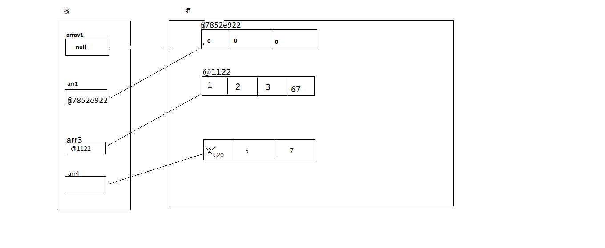
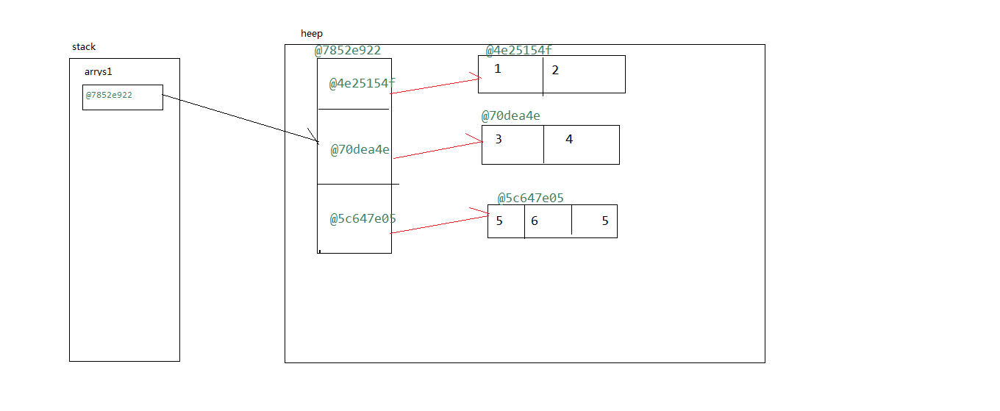
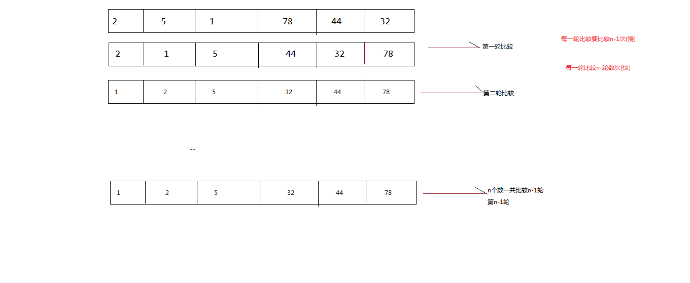

# 第四章：数组

- **概念**：数组就是一个存放同一类型数据的容器
- **特点：**
  - 定长的，数组一旦创建其长度不能改变
  - 数组能存放基本数据类型也能存放引用数据类型
  - 数组只能存放同一类型的数据
  - 数组是引用数据类型
    - 引用数据类型的值存在堆区,栈区中存放堆区对象的地址

- **数组的声明和创建**：

  ```java
  //		数组的声明
  		int[] array1;
  		int array2[];
  //		数组的创建
  		/**
  		 * ①数组名 = new  数据元素类型[ 元素个数 ]  --动态初始化:所有元素其实已经被初始化，元素都是默认值		 int[] arr1=new int[3];
  		 * new:内存空间分配符,在堆内存中创建一个对象(开辟一个内存空间)
  		 *    数组元素：数组中的每一个数据，称为数组的一个元素
  		 *   数组长度：数组元素的个数  
  		 *   注意：数组元素的数据类型必须和声明数组的数据类型一致
  		 *   
  		 *   ②数组类型[ ]   数组名=new 数据元素类型[] {元素1，元素2，…} --静态初始化：是在声明数组的同时就完成创建和初始化工作(初始化自定义值)
  		     int[] arr3=new int[] {1,2,3,67};
  		 *   
  		 *   ③数组类型[ ]  数组名 ={元素1，元素2，…}--静态初始化：是在声明数组的同时就完成创建和初始化工作(初始化自定义值)
  		 	int[] arr4= {2,5,7}; 	
  		 */
  //		以这种方式创建的数组,数组元素有默认值，int-0  double-0.0   引用数据类型-null char-0对应的字符  boolean-false
  		int[] arr1=new int[3];//3是数组的长度 
  		System.out.println("arr1:"+arr1);//@7852e922
  		System.out.println("arr1:"+Arrays.toString(arr1));//[0, 0, 0]
  		String[] arr2=new String[4];
  		System.out.println("arr2:"+Arrays.toString(arr2));//[null, null, null, null]
  		
  		int[] arr3=new int[] {1,2,3,67};//数组长度为4
  		System.out.println("arr3:"+Arrays.toString(arr3));//[1, 2, 3, 67]
  		
  		int[] arr4= {2,5,7};
  		System.out.println("arr4:"+Arrays.toString(arr4));//[2, 5, 7]
  ```

- ### 数组的访问、赋值和遍历数组

  ```java
  //		数组的访问  
  //		数组是一种数据结构：顺序存储,在物理地址连续的两个元素在内存地址中也连续,数组是有序的，有索引，索引从0开始
  //		数组的长度
  		System.out.println(arr4.length);//3
  //		通过数组下标(索引)访问数组
  		System.out.println(arr4[1]);//5
  //		注意：索引最大值为length-1 最小值为0 
  //		System.out.println(arr4[3]);//java.lang.ArrayIndexOutOfBoundsException 索引越界异常
  		
  //		数组的赋值
  		arr4[0]=20;
  		System.out.println("arr4:"+Arrays.toString(arr4));//[20, 5, 7]
  		arr1[0]=1;
  		arr1[1]=2;
  		arr1[2]=3;
  //		注意：只能对数组中的元素进行修改不能改变数组的长度，数组是定长
  		System.out.println("arr1:"+Arrays.toString(arr1));//arr1:[1, 2, 3]
  		
  //		遍历数组 使用for循环
  		/*for(int i=0;i<arr4.length;i++) {
  			System.out.println(arr4[i]);
  		}*/
  //		使用foreach：加强for循环
  		/**
  		 * for(容器中的元素数据类型  变量：容器对象){
  		 * 	
  		 * }
  		 * 
  		 */
  		for(int i:arr4) {
  			System.out.println(i);
  		}
  
  	}
  ```

  

- ## 数组的内存

  

- ## 二维数组的创建和使用

  

  ```java
  public static void main(String[] args) {
  
  		/**
  		 * java中没有二维数组只有：数组中存放数组
  		 */
  //		二维数组的声明
  		int[][] arr1;
  		int arr2[][];
  		int[] arr3[];
  //		创建二维数组
  		/**
  		 * 数组名 = new  数据元素类型[ 行数 ] [ 列数 ] ;
  		 * 数组名 = new  数据元素类型[ 行数 ] [   ] ;
  		 * 注意：行数就是数组元素的个数(素组的长度)   必须声明行的个数
  
  		 * 
  		 */
  		arr1=new int[3][3];//三行三列的二维素组
  		arr2=new int[4][]; //创建一个包含三个元素的二维数组
  //		arr3=new int[][5];  编译不通过
  		int[] arr4=new int[3];
  		
  //		二维数组的初始化
  		int[][] arrs1=new int[][] {{1,2},{3,4},{5,6,5}};
  		System.out.println(arrs1);//[I@7852e922
  		System.out.println(arrs1[0]);//[I@4e25154f
  		System.out.println(Arrays.toString(arrs1[0]));//[1, 2]
  		System.out.println(Arrays.toString(arrs1));//[[I@4e25154f, [I@70dea4e, [I@5c647e05]
  		
  //		二维数组的访问
  		System.out.println(arrs1[0][0]);
  		System.out.println(arrs1[0][1]);
  		System.out.println(arrs1[2][0]);
  		System.out.println("---------------------------------------");
  //		二维数组的遍历
  		for(int i=0;i<arrs1.length;i++) {
  			System.out.println(Arrays.toString(arrs1[i]));
  		}
  		System.out.println("---------------------------------------");
  		
  		for(int i=0;i<arrs1.length;i++) {
  			for(int j=0;j<arrs1[i].length;j++) {
  				System.out.println(arrs1[i][j]);
  			}
  		}
  //		二维数组的快速赋值 
  		/**
  		 * 需求：
  		 * 	创建一个三行三列的二维数组并且赋值
  		 * 	123
  		 * 	456
  		 * 	789
  		 */
  		int[][] arrs2=new int[3][3];
  		int num=1;
  		for(int i=0;i<arrs2.length;i++) {
  			for(int j=0;j<arrs2[i].length;j++) {
  				arrs2[i][j]=num;
  				num++;
  			}
  		}
  		System.out.println("---------------------------------------");
  		for(int i=0;i<arrs2.length;i++) {
  			System.out.println(Arrays.toString(arrs2[i]));
  		}
  		System.out.println("---------------------------------------");
  		
  //		2、生成一个4*6的二维整型数组，使用随机数填充，遍历输出该数组的所有值，并且找出最大值。
  		int[][] arrs3=new int[4][6];
  		Random r=new Random();
  		for(int i=0;i<arrs3.length;i++) {
  			for(int j=0;j<arrs3[i].length;j++) {
  				arrs3[i][j]=r.nextInt(101);	
  			}
  		}
  		int maxNum=0;
  		for(int i=0;i<arrs3.length;i++) {
  			for(int j=0;j<arrs3[i].length;j++) {
  				if(maxNum<arrs3[i][j]) {
  					maxNum=arrs3[i][j];
  				}
  			}
  		}
  		System.out.println("最大值为:"+maxNum);
  		
  	}
  ```

  

- ## 冒泡排序

  

```java
/**
 *  冒泡排序
 * @author Administrator 
 * 选择排序
 * 快速排序
 * 希尔排序
 */
public class BubblingSort {
	public static void main(String[] args) {
//		将数组{2,5,1,78,44,32}升序排序之后输出
	int[] arr1= {2,5,1,78,44,32};//6个数
	 for(int j=1;j<arr1.length;j++) {
		for(int i=0;i<arr1.length-1;i++) {
			if(arr1[i+1]<arr1[i]) {
				int temp=arr1[i];
				arr1[i]=arr1[i+1];
				arr1[i+1]=temp;
			}
		}
		System.out.println("第"+j+"轮"+Arrays.toString(arr1));
	}
	 System.out.println("--------------------------------------");
	 for(int j=1;j<arr1.length;j++) {
		for(int i=0;i<arr1.length-j;i++) {
			if(arr1[i+1]<arr1[i]) {
				int temp=arr1[i];
				arr1[i]=arr1[i+1];
				arr1[i+1]=temp;
			}
		}
		System.out.println("第"+j+"轮"+Arrays.toString(arr1));
	}
	 System.out.println("--------------------------------------");
	 for(int j=0;j<arr1.length-1;j++) {
		for(int i=0;i<arr1.length-j-1;i++) {
			if(arr1[i+1]<arr1[i]) {
				int temp=arr1[i];
				arr1[i]=arr1[i+1];
				arr1[i+1]=temp;
			}
		}
		System.out.println("第"+j+"轮"+Arrays.toString(arr1));
	}
//		将数组{2,5,1,78,44,32}降序排序之后输出
	 System.out.println("--------------------------------------");
	 for(int j=0;j<arr1.length-1;j++) {
		for(int i=0;i<arr1.length-j-1;i++) {
			if(arr1[i+1]>arr1[i]) {
				int temp=arr1[i];
				arr1[i]=arr1[i+1];
				arr1[i+1]=temp;
			}
		}
		System.out.println("第"+j+"轮"+Arrays.toString(arr1));
	}
	}
}
```

- ## 数组的操作_复制和排序

```java
public class ArrayOperation {

	public static void main(String[] args) {
//	数组的排序
//	将数组{2,5,1,78,44,32}升序排序之后输出
	int[] arr1= {2,5,1,78,44,32};	
	Arrays.sort(arr1);
	System.out.println(Arrays.toString(arr1));
		
//  数组的复制
//	将数组{23,45,7}复制到数组{1,2,3,4,5,6}中,规定复制开始位置为0，目标数组开始位置为3
	int[] source={23,45,7};
	int[] dest= {1,2,3,4,5,6};
	/**
	 * src:源数组
	 * srcpos:源数组开始索引
	 * dest:目标数组
	 * destPos：目标数组开始索引
	 * length：复制的长度
	 * 
	 */
//	System.arraycopy(source, 0, dest, 3, 3);
//	System.out.println(Arrays.toString(dest));//[1, 2, 3, 23, 45, 7]
	System.arraycopy(source, 1, dest, 3, 2);
	System.out.println(Arrays.toString(dest));//[1, 2, 3, 45, 7, 6]
	}

}

```

